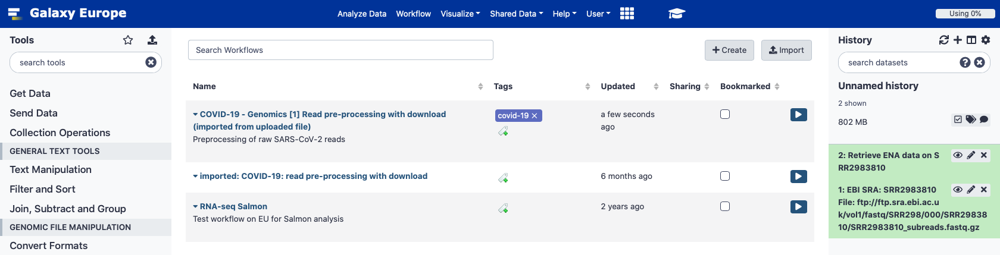

name: title_slide
layout: true
class: right, middle

background-image: url("images/ELIXIR_background.png")
background-position: top
background-repeat: no-repeat
background-size: contain

---
layout: true
name: galaxy_slide

background-color: #2c3143

---

layout: true

---
template: title_slide

## Enabling & stimulating submission to the COVID data portal & re-use of the data

### Frederik Coppens

#### November 2, 2020

---
class: center

### Virtual environment

### Seamless integration of services

#### data storage, data management, data analysis, re-use of data

### Across scientific disciplines and borders

---
template: title_slide

# Submission of raw data to ENA

---

# Viral data sharing practices

### GISAID appears to be standard

- consensus sequence only
- non-open data licence
- provenance issues

### Familiar & low volume

### Submission to ENA: learning curve

- large volumes of data
- controlled metadata

---

# Problem statement

.center[
### (clinical) labs do not have the time during the pandemic to develop new data sharing & submission protocols
]

# Solutions developed

### Targeted tools & documentation for viral data

### Brokering for Belgian researchers

---

# Python Command Line interface

### Makes submission easier for bioinformaticians

### Generates the required XML files out of easier-to-use tsv files

### Takes care of the ftp uploading

### Validates the metadata before submission

---

# Python Command Line interface

### Building on existing tools & infrastructure

* [Basic ENA upload tool in Galaxy](https://github.com/usegalaxy-eu/ena-upload-cli)
* [ENA API & documentation](https://ena-docs.readthedocs.io/en/latest/submit/general-guide.html)

### Available for all (contributions welcome)

.center[
[ Python package](https://pypi.org/project/ena-upload-cli/)
[ package](https://anaconda.org/bioconda/ena-upload-cli)
[ source code](https://github.com/usegalaxy-eu/ena-upload-cli)
]

---

# Galaxy tool

.center[

]

* User generated metadata
* In-tool generated metadata

.center[
Available in

]

---

# Container

### Local Galaxy in a container

### Raw data cleanup workflow: remove human traces

### Submission to ENA

.center[
docker run -p "8080:80" -v <absolute path>/.secret:/.secret -e WEBIN_ID="Webin-*****" -e WEBIN_SECRET="/.secret" --privileged quay.io/galaxy/ena-upload
]

---

# Interacting with ENA

### Submission requires ENA Webin account

* Parameter when starting the container
* Extra step for researchers...

### Brokering as a service (in Belgium)

* Submitted data for Insitute of Tropical Medicine (Antwerp)
* Submission for Erasmus Hospital (ULB) in progress
* In contact with University of Liege

### Currently limitations for use in a public Galaxy

* Private instance
* Local Galaxy (e.g. container)

---

# Data from BE in data portal !

---

# Documentation (in progress)

.center[[https://rdm.elixir-belgium.org/covid-19/sarscov2_submission](https://rdm.elixir-belgium.org/covid-19/sarscov2_submission)]

---

# The  ecosystem

---

# Galaxy workflows

.center[

]

---

# WorkflowHub.eu

Lead by Carole Goble

---

# GA4GH Tool Repository Service in Galaxy

By Björn Grüning

---

# GA4GH Tool Repository Service in Galaxy

By Björn Grüning

---

# Webinars

.center[
[https://elixir-europe.org/events/webinar-galaxy-elixir-covid19](https://elixir-europe.org/events/webinar-galaxy-elixir-covid19)

New series being planned (early 2021)
]
---

# Conclusion

### Tools for submission developed

* Command line interface
* Galaxy tool
* Container deployment
* Dissemination in progress

### Integrated in ecosystem

.center[

]
---

# Future work

### Dedicated Galaxy instance for brokering: usegalaxy.be/covid-19

### Integrate user credentials for ENA into Galaxy

### Integrate submission to GISAID

### Integrate submission of other data types

---

## Acknowledgements

 | 
---- | ----
     | <ul><li>Miguel Roncoroni</li> <li>Kim De Ruyck</li> <li>Ignacio Eguinoa</li> <li>Bert Droesbeke</li>  <li>Flora d'Anna</li>  <li>Vahid Kiani</li>  </ul>
   | <ul><li>Björn Grüning</li> <li>Dilmurat Yusuf</li></ul>
   | <ul><li>James Taylor</li> <li>Anton Nekrutenko</li></ul>
   | <ul><li>Álvaro Simon Garcia</li> <li>Stijn De Weirdt</li></ul>
   | <ul><li>Carole Goble</li> <li>WorkflowHub Club</li></ul>
   | <ul><li>Guy Cochrane</li> <li>Nadim Rahman</li></ul>
  |
---
class: center, middle

