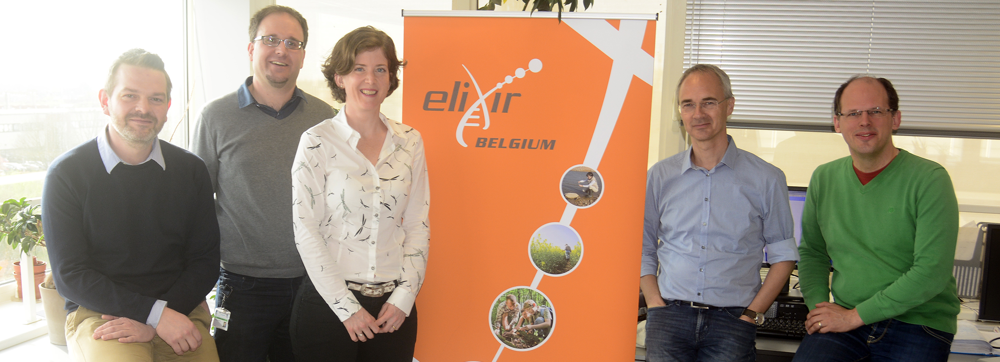
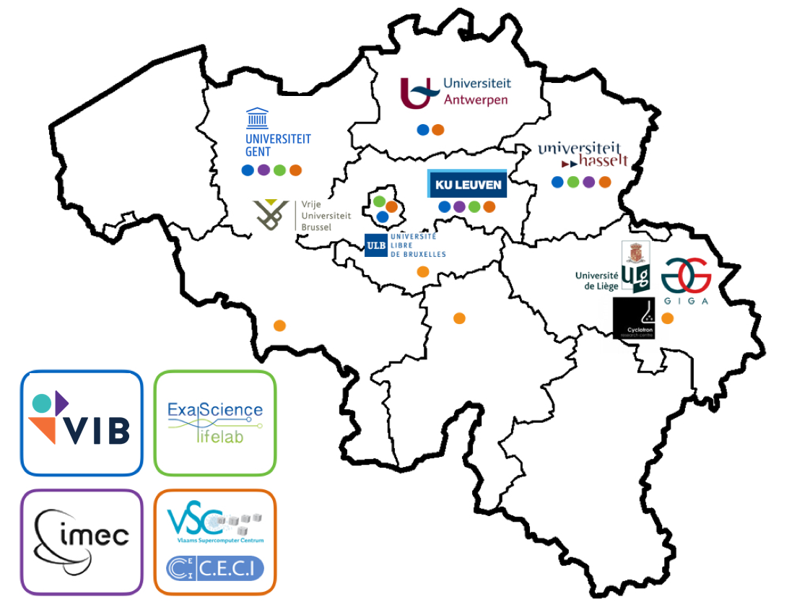
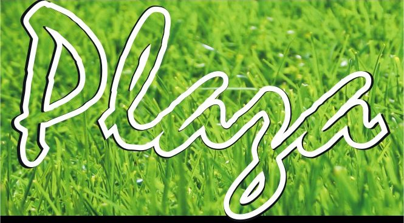
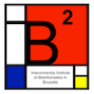

name: title_slide
layout: true
class: right, middle

background-image: url("images/ELIXIR_background.png")
background-position: top
background-repeat: no-repeat
background-size: contain

---

layout: true

---
template: title_slide

# ELIXIR

## Safeguarding the results of life science research in Europe

.italic[www.elixir-europe.org]

---
template: title_slide

# ELIXIR Belgium

## Frederik Coppens

* Data-Driven Innovation in Food, Nutrition and Microbiome
* Koninklijke Vlaams Schouwburg, Brussels, October 9-10, 2017

.italic[www.elixir-belgium.org]

---

# Outline

## .highlight[ A short history ]
## .highlight[ Objectives ]
## .highlight[ Node Services ]
## .highlight[ Towards the future ]

---

template: title_slide

# A short history

---

# Towards a Belgian node

* December 2013 : Memorandum of Understanding, Belgium joins ELIXIR
* November 2015 : ELIXIR Consortium Agreement, full ELIXIR Member
* November 2017 : ELIXIR Collaboration Agreement, bilateral agreements in place

.center[]
.center[Lead institute ELIXIR Belgium]

---

# Funding

 | 
---- | ----
ELIXIR membership fee | 
Project Coordinator | 
ESFRI structural funding |  
H2020 ELIXIR-Excelerate | 
ELIXIR projects | 

---
class: center, middle

# Members of the lead institute

 | 
---- | ----
 Yves Van de Peer | Head of Node
 Frederik Coppens | deputy Head of Node & Technical Coordinator
 Kim De Ruyck | Coordinator ELIXIR Belgium
 Lieven Sterck | Technical Coordinator
 Alexander Botzki | Training Coordinator
 Kristoffer Rapacki | Data Science Cloud Coordinator
 Paula Andrea Martinez | Trainer

---
class: center, middle

# Partners of ELIXIR Belgium

---

template: title_slide

# Objectives

---

class: center, middle

# Aim of ELIXIR Belgium

### .quote[ to ensure that Belgian researchers can focus on their research question, rather than technical details of data, interoperability, compute resources, … by providing tailored solutions based on an interoperable infrastructure across Europe.]

---
class: center, middle

# Connecting people

## on a national level

### .highlight[Establish a connected bioinformatics community]

* Organize & support events
* Newsletter
* www.elixir-belgium.org
*  @ELIXIRnodeBE

---
class: center, middle

# Connecting people

## internationally

### .highlight[Integrate into the European & international community]

* events by ELIXIR Nodes
* stimulate collaboration
* www.elixir-europe.org
*  @ELIXIREurope

---
class: center, middle

# Connecting people

## between academia and industry

### .highlight[bring together all users of bioinformatics resources]

---
template: title_slide

#  Node Services

<!--
* Sustainable agriculture
* Human health
* Proteomics
-->

---

# Human Health

###  .highlight[ NGS Logistics]
#### .highlight[ Yves Moreau, KU Leuven ]

Platform for federated analysis of variants

###  .highlight[ VariantDB ]
#### .highlight[  Geert Vandeweyer, Kris Laukens, UAntwerpen ]

Versatile annotation and filtering database: allele frequencies, functional impact, pathogenicity predictions and pathway information

---

# Human Health

###   .highlight[ MS DataConnect ]
#### .highlight[ Liesbet Peeters, Dirk Valkenborg, UHasselt ]
FAIR data for next generation management of multiple sclerosis

---

# Beacons

.highlight[Drive implementation of the Beacon technology within ELIXIR nodes]

ELIXIR Authentication and Authorisation Infrastructure

  | 
---- | ----
Public | Accessible to internet users
Registered  | Accessible to bona fide researchers
Controlled  | Authorized, signed agreement needed

 NGS logistics

---

# Sustainable agriculture

###   .highlight[ PLAZA ]
#### .highlight[ Klaas Vandepoele, VIB/UGent ]
Plant comparative genomics analysis platform

###   .highlight[ ORCAE ]
#### .highlight[  Lieven Sterck, Yves Van de Peer, VIB/UGent ]
Online resource for curation and annotation of eukaryotic genomes

---

# Proteomics

###   .highlight[ Tabloid Proteome ]
#### .highlight[ Lennart Martens, VIB/UGent ]
Database of protein association network generated using publicly available mass spectrometry based experiments in PRIDE

###   .highlight[ Unipept ]
#### .highlight[ Peter Dawyndt, UGent ]
metaproteomics data-analysis tool, focus on interactive data visualisations

---

# Proteomics

###   .highlight[ (IB)² services and databases ]
#### .highlight[ Wim Vranken, VUB ]

* DynaMine: a fast predictor of protein backbone dynamics based sequence information
* DEOGEN2: prediction and interactive visualisation of single amino acid variant deleteriousness in human proteins

---
# Training

Event | In collaboration with | Scheduled
---- | ---- | ----
BYOD BrAPI hackathon | ELIXIR The Netherlands | May 2017
Node services: PLAZA | VIB Bioinformatics Core | September 2017
Bio-molecular data-mining | Kris Laukens (UAntwerpen) | September 2017
Python for Data Processing | Geert-Jan Bex (KUL/UHasselt) | October 2017
Data Carpentry | VIB Bioinformatics Core | November 2017

### Future

* Galaxy
* FAIR data & data management
* Software best practices

---
template: title_slide

# Towards the future

---

# ELIXIR Communities

*   Marine metagenomics
*   Plant Sciences
*   Human Data
*   Rare Diseases

### New in 2017

* Proteomics
* Metabolomics
* Galaxy

---

# Activities in new Communities

### Proteomics

* Co-lead Community (Lennart Martens)
* Add Node Services

### Belgian Metabolomics meeting

* September 29, 2017, Ghent
* 18 research groups represented

### ELIXIR Galaxy Community

* Co-lead Community (Frederik Coppens)
* Public webserver
* Training

---

# Activities in Platforms

  |   | 
---- | ---- | ----
 | .highlight[Compute] | Cloud in collaboration with VSC
 | .highlight[Data] | improve link with ELIXIR Core Data Resources
 | .highlight[Interoperability]  | BioSchemas, Open Data & Data Management
  | .highlight[Tools]  | bio.tools, workflows, containers
  | .highlight[Training]  | Continue, expand training portfolio & publish in TeSS

---

# Extending our network

### Prospective new partner
  Scientific Institute for Public Health (WIV-ISP)

### Establishing collaborations

* ESFRIs
* Strategic Research Centers (SOCs)
* SMEs & industry
* Research institutes

e.g. through Interest Group(s)

---

class: center, middle

