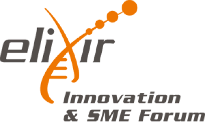

# Some recent history ...

---Section---

## Towards a Belgian node

<h3 id="center100"> December 2013 </h3>

Memorandum of Understanding signed

Belgium joins ELIXIR

Membership fee covered by federal government

VIB lead institute ELIXIR Belgium

---Section---

## Towards a Belgian node

<h3 id="center100"> November 2015 </h3>

ELIXIR Consortium Agreement signed

Belgium becomes Full member of ELIXIR

<h3 id="center100"> May 2016 </h3>

Project coordinator starts

---Section---

## Members of the lead institute

Yves Van de Peer
Head of Node

Lieven Sterck
Technical Coordinator

Kim De Ruyck
Project Coordinator

Frederik Coppens 
deputy Head of Node & Technical Coordinator

Alexander Botzki 
Training Coordinator

 

Note:
Yves Van de Peer
Professor and group leader of the Bioinformatics and Evolutionary Genomics group. He has ample experience in the fields of gene prediction and genome annotation, comparative and evolutionary genomics, and systems biology.

Frederik Coppens
Project Leader Applied Bioinformatics & Biostatistics group at VIB and IT manager at VIB.
Highly involved in ELIXIR, more specifically in the ELIXIR’s Galaxy working group and the ELIXIR’s Data Management Plans working group. Also involved in the ELIXIR-Excelerate project, participating in WP7 on the Plant Use Case.

Lieven Sterck
Senior researcher in bioinformatics at VIB. Specialized in genome annotation. Involved in the ELIXIR-Excelerate project, participating in WP10 on the Genome Annotation.

Alexander Botzki
Manager of BITS at VIB. Involved in the ELIXIR-Excelerate project, participating in WP11 on Training.

Kim De Ruyck
Responsible for the coordination of the establishment of the Belgian ELIXIR node. Central contact person.

---Section---

## ELIXIR Belgium Partners

---Section---

---Section---

## Connecting people

### on a national level

> Establish a connected bioinformatics community in Belgium

* Organize & support events
* Newsletter
* www.elixir-belgium.org
*   @ELIXIRnodeBE #ELIXIRbe17

---Section---

## Connecting people

### internationally

> Integrate into the European & international community

* events by ELIXIR nodes
* stimulate collaboration
* www.elixir-europe.org
*  @ELIXIREurope

---Section---

## Connecting people

### between academia and industry

> bring together all users of bioinformatics resources

---Section---

<h2 style="font-size:140%;margin-top:40px"> on Food and Nutrition Data </h2>
#### October 9-10 2017, KVS, Brussels

* Aimed at companies in probiotics, food, health, …
* Stimulate interaction between companies and academia
* Introduce free tools, data resources and services available through ELIXIR
* Highlight examples of research-intensive companies already making use of big data

Note:
ELIXIR Belgium will run an Innovation and SME Forum in 2017, focused on the theme of food and nutrition data. Link this event with the OECD meeting organized by EWI. Organisation for Economic Co-operation and Development

---Section---

<h2 style="margin-top:70px;margin-bottom:100px;float:left;width:70%"> Node Services </h2>

---Section---

## Human health

NGS Logistics Platform for federated analysis of variants

---Section---

## Sustainable agriculture

Plant comparative genomics analysis platform

 Online resource for curation and annotation of eukaryotic genomes

---Section---

## Trainings & workshops

| Event                      | Organised By  | Scheduled     |
| -------------------------- | ------------- | ------------- |
| Node services: PLAZA | VIB Bioinformatics Core | May 2017 |
| Data Carpentry | VIB Bioinformatics Core | November 2017 |
| Python as a second language  | VSC, UHasselt, Uantwerpen | Q2 2017 |
| Programming Python  | Jean-Marie Jacquet (UNamur) | Q4 2017 |
| Winter school Transcriptomics  | DTL (NL), VIB Bioinformatics Core, ELIXIR Belgium | Q4 2017 |

Note:
FAIR data

---Section---

# The next steps ...

---Section---

## Towards a Belgian node

<h3 id="center100"> January 2017 </h3>

ELIXIR Belgium awarded funding  for 2017-2018

---Section---

## Strengthen existing Node services

Job openings for Training & Development

---Section---

## Expand our Node services

> Tools & resources from Flemish ELIXIR Belgium partners

* Human clinical and health ‘omics and informatics
* Agricultural ‘omics and data resources
* Trainings in data science and data management

---Section---

## Expand our Node services

* Strong complementarity to the ELIXIR programme
* Aligned to the ELIXIR platforms:  Compute, Data, Interoperability, Tools, Training
* Evidence of community outreach and adoption
* Potential for cross-Node collaborations

 15/03/2017 
 14/04/2017 
 May 2017 

project proposal deadline 
evaluation completed 
final decision making and reporting 

---Section---

# Aim of ELIXIR Belgium

> to ensure that Belgian researchers can focus on their research question, rather than technical details of data, interoperability, compute resources, … by providing tailored solutions based on an interoperable infrastructure across Europe.

---Section---

# Questions ?
