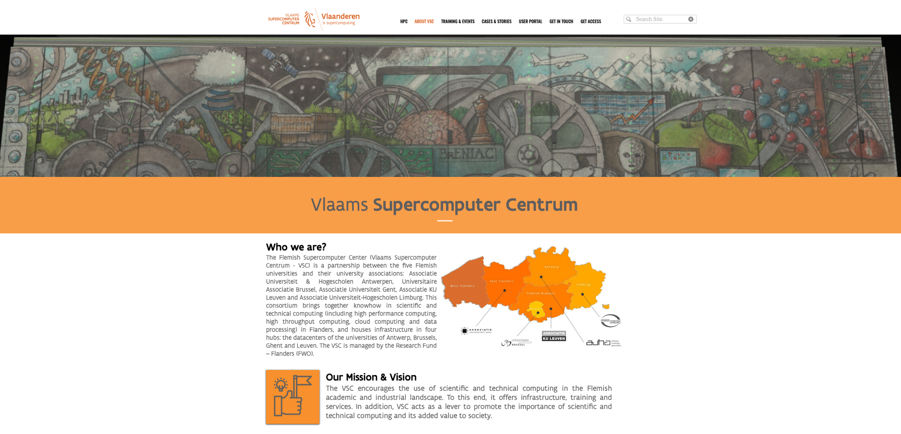
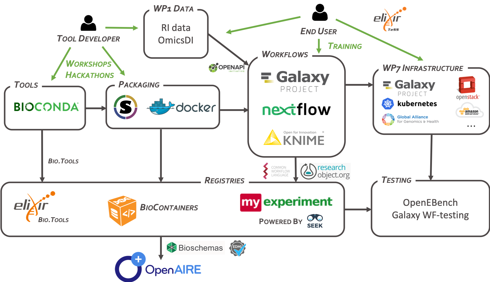

name: title_slide
layout: true
class: right, middle

background-image: url("images/ELIXIR_background.png")
background-position: top
background-repeat: no-repeat
background-size: contain

---
layout: true
name: galaxy_slide

background-color: #2c3143

---

layout: true

---
template: title_slide

## European Open Science Cloud, towards Open Data and Open Science

### Frederik Coppens

#### Advancing data stewardship - February 28, 2020

???

http://lifewatch.be/en/advancing-data-stewardship

---
class: center, middle

---

#### "trusted space for researchers to store their data and access data from other disciplines."

#### "a trusted pool of non-personalised data that governments, businesses and other stakeholders can contribute to...thereby opening up a resource for innovation."

#### "co-create a framework to allow the use of this data."

---
class: center

### Virtual environment

### Seamless integration of services

#### data storage, data management, data analysis, re-use of data

### Across scientific disciplines and borders

---
class: center, middle

---

# Working Groups

### **FAIR** : André Heughebaert

### **Landscape** : Sadia Vancauwenbergh

### **Rules of Participation** : Rachel Leproult

### **Sustainability** : Patricia Mergen

### **Architecture** : Frederik Coppens

### **Skills & Training** : Sadia Vancauwenbergh

---

# Working Groups

### **FAIR** : metrics, PID

### **Landscape** : mapping

### **Rules of Participation**

### **Sustainability** : beyond 2020

### **Architecture** : federating core, AAI

### **Skills & Training**

---

# Task forces

#### FAIR

* FAIR practice
* Metrics & Certification
* **PID**
* **Interoperability**

#### Architecture

* AAI
* **PID**
* **Interoperability**

#### Sustainability

* Strawman Feedback
* Business Model
* Legal Entities
* Integration of National Infrastructures

---

# EOSC projects

---
template: title_slide

# ESFRI

---
class: center, middle

# European Strategy Forum on Research Infrastructures

## a strategic instrument to develop the scientific integration of Europe and to strengthen its international outreach

https://www.esfri.eu

---

# ESFRI clusters

### Energy
### Environment
### Health & Food
### Physical Sciences & Engineering
### Social & Cultural Innovation
### Data, Computing and Digital Research Infrastructures

---

## Domain specific implementation

.center[

]

---
.center[

]

#### Publishing FAIR life science data resources
#### Establish the policies needed for access

#### Create an ecosystem of innovative life-science tools
#### Connect them to users via a shared single login system

#### Enable ground-breaking data driven research in Europe by connecting life scientists to interoperable European clouds via open calls for participation

---
class: center, middle

---

---
template: title_slide

## Cloud applications in a EU and Flemish context

### Frederik Coppens

#### Advancing data stewardship - February 28, 2020

---

#### "trusted space for researchers to store their **data** and *access* **data** from other disciplines."

#### "a trusted pool of non-personalised **data** that governments, businesses and other stakeholders can contribute to...thereby opening up a resource for innovation."

#### "co-create a framework to *allow the use* of this **data**."

---
class: center, middle

---
class: center, middle

---
class: center, middle

## From data to software and analysis workflows

---

# Embracing cloud

### Cloud == a computer provided by someone else

### Go beyond 'lift & shift'

### but going cloud-native

---
class: center

# Cloud native

## pets versus cattle

---

# Standardized containers

.center[

]

---

## Container-based microservices

.center[

]

---

template: title_slide

# Cloud Services

---
class: center, middle

---
class: center, middle

---
class: center, middle

---
template: title_slide

# Flemish Infrastructure

---
class: center, middle

---
class: center, middle

---
class: center, middle

---
class: center, middle

---
template: title_slide

# Cloud data analysis

---
class: center, middle

---

template: title_slide

---
class: center, middle

.title[
## Galaxy is an .highlight[open], web-based platform for .highlight[accessible], .highlight[reproducible], and .highlight[transparent] computational biomedical research
]

#usegalaxy @galaxyproject

---
class: center, middle

.title[
## Galaxy enables non-technical users to leverage bioinformatics tools .highlight[themselves] to analyse their data and share results
]
???

* workflow management system
* web-based user-interface
* inherent support for reproducible science
* facilitates sharing of data and results
* removes the need for users to compile and install tools
* allows non-technical users to leverage compute clusters

---

# usegalaxy.*

### Global collaboration

  #### usegalaxy.eu (Germany)
  #### usegalaxy.org (US)
  #### usegalaxy.org.au (Australia)
  #### .highlight[usegalaxy.be] (Belgium)

### Facilitate reproducible analyses across sites
  - Common core set of tools
  - Common reference data

---
class: center, middle

---

# Why usegalaxy.be ?

### Broadly used: ELIXIR Galaxy Community

### Contribute to a global collaboration

* Build on the community effort
* Share the burden

### Dedicated compute resources 

### Can be tailored to our specific needs

---

# Reference data

#### Genome sequences
#### Annotations
#### Indices for common tools
#### Automation through [ephemeris](https://ephemeris.readthedocs.org/)

### Plant genomes provided by ELIXIR Belgium

---

# COVID-19

 https://doi.org/10.1101/2020.02.21.959973

 https://github.com/galaxyproject/SARS-CoV-2

---
class: middle, center

# Beyond Life Sciences

#### Genomics, Proteomics, Metabolomics, Epigenetics, ...
#### Machine learning
#### Natural Language Processing
#### Ecology

<iframe width="560" height="315" src="https://www.youtube.com/embed/U6mu3QrK9Ao" frameborder="0" allow="accelerometer; autoplay; encrypted-media; gyroscope; picture-in-picture" allowfullscreen></iframe>

---
class: center, middle

#### Thousands of documented and maintained tools

#### Free to use

#### 50 GB for registered users (5GB for unregistered users)

#### Real time status on https://usegalaxy.be/stats/

### Requests ? Encounter issues ?

## galaxy@elixir-belgium.org

---

# Future plans

### Provenance: tracking of metadata
### Expand portfolio of tools, workflows, data, ...
### Integration with data management platform
### Further improve usability & interoperability

---

# Acknowledgements

 | 
---- | ----
     | <ul><li>Ignacio Eguinoa</li> <li>Bert Droesbeke</li> <li>Michiel Van Bel</li>  <li>Flora d'Anna</li>  <li>Vahid Kiani</li>  <li>Kiran Telukunta</li>  <li>Miguel Roncoroni</li>  <li>Kim De Ruyck</li></ul>
   | <ul><li>Björn Grüning</li> <li> Helena Rasche</li> <li>Bérénice Batut</li></ul>
   | <ul><li>James Taylor</li> <li>Anton Nekrutenko</li></ul>
   | <ul><li>Álvaro Simon Garcia</li> <li>Stijn De Weirdt</li></ul>

---
class: center, middle

