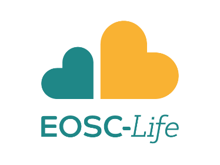
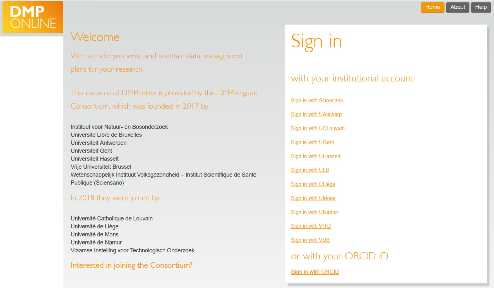

name: title_slide
layout: true
class: right, middle

background-image: url("images/ELIXIR_background.png")
background-position: top
background-repeat: no-repeat
background-size: contain

---
layout: true
name: galaxy_slide

background-color: #2c3143

---

layout: true

---
template: title_slide

## Connecting ESFRIs:
## Collaboration between
## Research Infrastructures

### Frederik Coppens

#### Launch event IRI call 2020

---
class: center, middle

# European Strategy Forum on Research Infrastructures

## a strategic instrument to develop the scientific integration of Europe and to strengthen its international outreach

https://www.esfri.eu

---

# ESFRI clusters

### Energy
### Environment
### Health & Food
### Physical Sciences & Engineering
### Social & Cultural Innovation
### Data, Computing and Digital Research Infrastructures

---
class: center

### Virtual environment

### Seamless integration of services

#### data storage, data management, data analysis, re-use of data

### Across scientific disciplines and borders

### ESFRI Forum: domain specific implementation

---

# ENVRI-FAIR & EOSC-Life

.center[

]

---

# International Research Infrastructures in Flanders

.italic[
### The Science Commission (FWO) identified a number research infrastructures in Flanders that include data platforms and that would benefit from closer co-ordination with the ELIXIR node
]

---

# Implementing EOSC: ESFRI driven Open Science

#### EWI-funded project
#### Original scope: ELIXIR & LifeWatch
#### Expanded to ESFRIs in Flanders on Environment and Health & Food

.center[

]

---

# Implementing EOSC: ESFRI driven Open Science

#### Build expertise and knowledge across ESFRIs
#### Expedite adoption of the VSC cloud resources by other scientific domains
#### Explore synergy in development of research infrastructure
#### Explore related collaborations within Flanders

#### To allow ESFRIs to provide services to their communities within the context of the European Open Science Cloud (EOSC)

#### Proof-of-Concept for the Flemish Open Science Board (FOSB)

---

# ESFRIs in Flanders

### Environment

 | 
---- | ----
 | e-Infrastructure for Biodiversity and Ecosystem Research
 | Distributed System of Scientific Collections
 | Integrated Carbon Observation System

---

# ESFRIs in Flanders

### Health & Food

 | 
---- | ----
[ </img>](https://www.elixir-europe.org) | A distributed infrastructure for life-science information
 |  Infrastructure for Analysis and Experimentation on Ecosystems
 |  European Research Infrastructure for Imaging
 |   European Marine Biological Resource Centre
 |   Integrated Structural Biology Infrastructure

---
template: title_slide

# The plan

### Data Management Tools
### Cloud applications and integrations
### Open Science Communication

---

# Data Management Tools

### Aim

#### Solutions to develop and implement DMP
#### Based on community standards

### Deliverables

#### Reporting on status, challenges and potential solutions
#### Knowledge base with information and guidance

---
class: center, middle

---
class: center, middle

---
class: center, middle

---
class: center, middle

---

# Cloud applications and integrations

### Aim

#### Data management should be supportive of analysis and re-use of data

### Deliverables

#### Reporting on needs in cloud applications
#### Demonstrate integration between analysis & management

---
class: center, middle

---
class: center, middle

---
# Open Science Communication

### Aim

#### Increase awareness of open access to all stake holders

  * Researchers
  * Data stewards
  * Funders
  * Policy makers

#### Targeted to environment & life sciences
#### Pragmatic solutions

### Deliverables

#### Workshops for data stewards and users

---
class: center

<h1> Connecting ESFRI and the  </h1>

June 5, 2019

.center[

]

https://www.ewi-vlaanderen.be/evenementen/connecting-esfri-and-european-open-science-cloud-eosc

---

## Research Data Management & Data Stewardship: much more than a FAIRytale

December 12, 2019

### DMP life cycle

#### DMPs: past, present and future

#### How does the GDPR impact research

#### 10 commandments in RDM funder compliancy

#### The complexity of clinical data

#### Towards FAIR Data Steward as a profession for the Life Sciences

---

## Research Data Management & Data Stewardship: much more than a FAIRytale

December 12, 2019

### Practical use-case

#### FAIRDOM (SEEK): The antidote to the research data management nightmare

#### Generating reproducible workflows for the publication of open and FAIR data on the Global Biodiversity Information Facility (GBIF)

#### Bioschemas: using semantic markup to improve the Findability of your data

#### “At the coalface”: FAIRifying the VLIZ datasystems

https://training.vib.be/research-data-management-data-stewardship-much-more-fairytale

---

## Data Stewardship meeting

### Audience

#### Data stewards in institutes and research groups in environmental & life sciences

### Aim

#### Knowledge exchange: practices, used services & solutions, needs for assistance

### February 2020

### Flanders Marine Institute, Ostend

.center[

]

---
class: center, middle

 |   | 
---- | ---- | ----
ResearchInfrastructures |  | 
 |  | [ </img>](https://www.elixir-europe.org)
 |  | 
 |  |  
