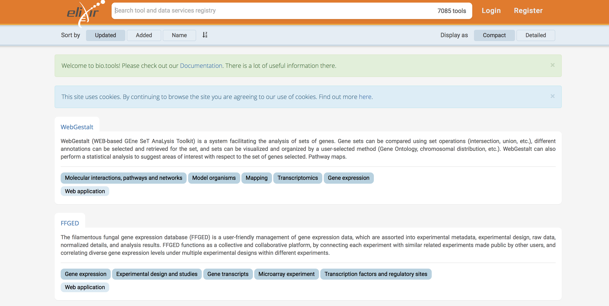

name: title_slide
layout: true
class: right, middle

background-image: url("images/ELIXIR_background.png")
background-position: top
background-repeat: no-repeat
background-size: contain

---

layout: true

---
template: title_slide

## ELIXIR : Safeguarding life science research data in Europe

### Frederik Coppens

#### fig**share** fest Belgium 2017

.italic[www.elixir-europe.org]
 
[https://frederikcoppens.github.io/slidedecks/](https://frederikcoppens.github.io/slidedecks/)

---

# Outline

### ELIXIR & ELIXIR Belgium

### Services

#### Platforms

#### Communities

---

template: title_slide

# ELIXIR: European infrastructure for biological information

---

# European infrastructure for biological information

 | 
---- | ----
Train driver | People !
Train wagon | .highlight[Services]
Train tracks | Hardware

---
class: center, middle

# Data infrastructure for Europe’s life-science research

???

ELIXIR is an intergovernmental organisation that brings together life science resources from across Europe. These resources include databases, software tools, training materials, cloud storage and supercomputers.

The goal of ELIXIR is to coordinate these resources so that they form a single infrastructure. This infrastructure makes it easier for scientists to find and share data, exchange expertise, and agree on best practices. Ultimately, it will help them gain new insights into how living organisms work.

---
class: center, middle

# European-wide effort

---

template: title_slide

# ELIXIR Belgium

---

# Towards a Belgian node

* December 2013 : Memorandum of Understanding, Belgium joins ELIXIR
* November 2015 : ELIXIR Consortium Agreement, full ELIXIR Member
* November 2017 : ELIXIR Collaboration Agreement, bilateral agreements in place

.center[]
.center[Lead institute ELIXIR Belgium]

---
class: center, middle

# Partners of ELIXIR Belgium

---

class: center, middle

# Members of the lead institute

 | 
---- | ----
 Yves Van de Peer | Head of Node
 Frederik Coppens | deputy Head of Node & Technical Coordinator
 Kim De Ruyck | Coordinator ELIXIR Belgium
 Lieven Sterck | Technical Coordinator
 Alexander Botzki | Training Coordinator
 Kristoffer Rapacki | Data Science Cloud Coordinator
 Paula Andrea Martinez | Trainer

 ---

 # Funding

  | 
 ---- | ----
 ELIXIR membership fee | 
 Project Coordinator | 
 ESFRI structural funding |  
 H2020 ELIXIR-Excelerate | 
 ELIXIR projects | 

---

class: center, middle

# Aim of ELIXIR Belgium

### .quote[ to ensure that Belgian researchers can focus on their research question, rather than technical details of data, interoperability, compute resources, … by providing tailored solutions based on an interoperable infrastructure across Europe.]

---

class: center, middle

# Connecting people

## on a national level

### .highlight[Establish a connected bioinformatics community]

* Organize & support events
* Newsletter
* www.elixir-belgium.org
*  @ELIXIRnodeBE

---
class: center, middle

# Connecting people

## internationally

### .highlight[Integrate into the European & international community]

* events by ELIXIR Nodes
* stimulate collaboration
* www.elixir-europe.org
*  @ELIXIREurope

---
class: center, middle

# Connecting people

## between academia and industry

### .highlight[bring together all users of bioinformatics resources]

---
template: title_slide

# Services

---
class: center, middle

# ELIXIR Services

---

class: center, middle

# Data infrastructure for Europe’s life-science research

New Communities: Proteomics, Metabolomics, Galaxy

---
class: center, middle

# ELIXIR Services

---

# FAIR Data Position Paper

1. .highlight[Open sharing of research data is a core principle] for publicly-funded research and ELIXIR encourages   all   funders   to   adopt   Open   Data   mandates.
2. .highlight[Data   Management   is   crucial]   part   of   good   scientific   practice   and   research   excellence.
3. Whenever possible, biological research data should be submitted to the recommended
community   .highlight[deposition   databases].
4. All data submitted to Open Data archives must be .highlight[annotated] in accordance with
.highlight[community-defined  standards].
5. .highlight[ELIXIR Nodes] are the national implementation of a harmonised FAIR Data Management
programme   for   the   life   sciences.
6. FAIR   data   management   requires   .highlight[professional   skills]   and   adequate   resources.
7. Good   research   data   management   requires   appropriate   .highlight[funding   for   data   infrastructures].

[https://www.elixir-europe.org/news/position-paper-fair-data-management](https://www.elixir-europe.org/news/position-paper-fair-data-management)

---

template: title_slide

# ELIXIR Platforms

---

# Data Platform

### ELIXIR Core Data Resources

* fundamental importance to the wider life-science community
* long-term preservation of biological information
* ensure sustainability

https://www.elixir-europe.org/platforms/data/core-data-resources

---

# Data Platform

### Deposition Databases for Biomolecular Data

 | 
---- | ----
ArrayExpress | Functional genomics data
BioModels	| Computational models of biological processes
EGA	| Genetic and phenotypic data from biomedical research projects
ENA | Nucleotide sequence information
IntAct	| Molecular interaction data
MetaboLights	| Experimental metabolomics data
PDBe	| Biological macromolecular structures
PRIDE	| Mass spectrometry-based proteomics data

https://www.elixir-europe.org/platforms/data/elixir-deposition-databases

---

# Interoperability Platform

.quote[ELIXIR encourages the life science community to adopt standardised file formats, metadata, vocabularies and identifiers.]

### FAIR principles

### Interoperability provisioning profile

* how metadata is annotated: at acquisition, at source or retrospective
* direct or indirect cooperation of providers in annotation and harvesting

### Interoperability value proposition

* what is the effort / return for the stakeholder

[https://www.elixir-europe.org/platforms/interoperability](https://www.elixir-europe.org/platforms/interoperability)

---

# BioSchemas.org

* .highlight[Schema.org] semantic markup of webpages
* collection of specifications that provide guidelines for markup within the life sciences

.center[]

---

# FAIRsharing.org

(formerly BioSharing.org)

.center[]

---

# Tools Platform

.quote[improve the discovery, quality and sustainability of software resources]

#### Tools and services registry
#### Scientific benchmark and technical monitoring
#### Software deployment
#### Workflows and workbenches
#### Software best practices

[Jiménez et al. Four simple recommendations to encourage best practices in research software. F1000Research 2017, 6:876](http://dx.doi.org/10.12688/f1000research.11407.1)

#### Tools interoperability (e.g. Common Workflow Language)
#### Galaxy

[https://www.elixir-europe.org/platforms/tools](https://www.elixir-europe.org/platforms/tools)
---

# bio.tools

.center[]

---

# biocontainers.pro

.center[]

.center[]

---

# Galaxy

.center[]

---

# ELIXIR Galaxy Community

.center[]

Co-chairing with Björn Grüning (de.NBI, ELIXIR Germany)

???

* A European network of Galaxy communities
* Visualisation in Galaxy
* Galaxy cloud infrastructure across Europe
* Data access & integration in Galaxy
* Bringing Tools and Data together
* Training
* FAIR and Galaxy

---

# Compute Platform

### ELIXIR AAI

---

# Training Platform

Software & Data Carpentry

---

# Training eSupport System (TeSS)

* Platform to disseminate, discover & package training resources, training materials and events
* Aggregating information from ELIXIR nodes and various 3rd-party content providers

 [https://tess.elixir-uk.org](https://tess.elixir-uk.org)

.right[]

---

# TeSS workflows

<iframe width="800" height="500" src="https://tess.elixir-europe.org/workflows/chip-seq-workflow/embed"></iframe>

---

# Data management Working Group

* Build a network of Data Stewards
* Provide a checklist
* Complementary to dmponline

### Data Stewardship Wizard

Work in progress:  https://dmp.fairdata.solutions

---

# ELIXIR take home

*

---

class: center, middle

