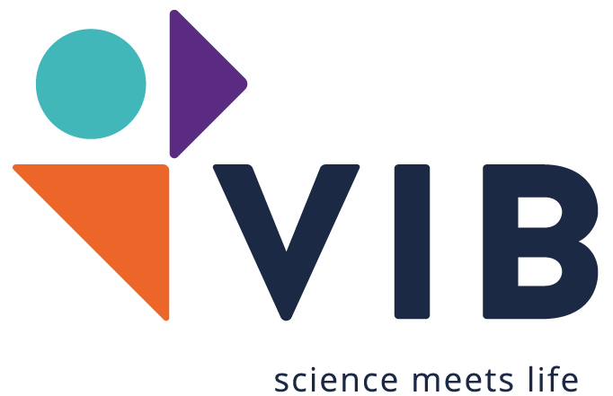
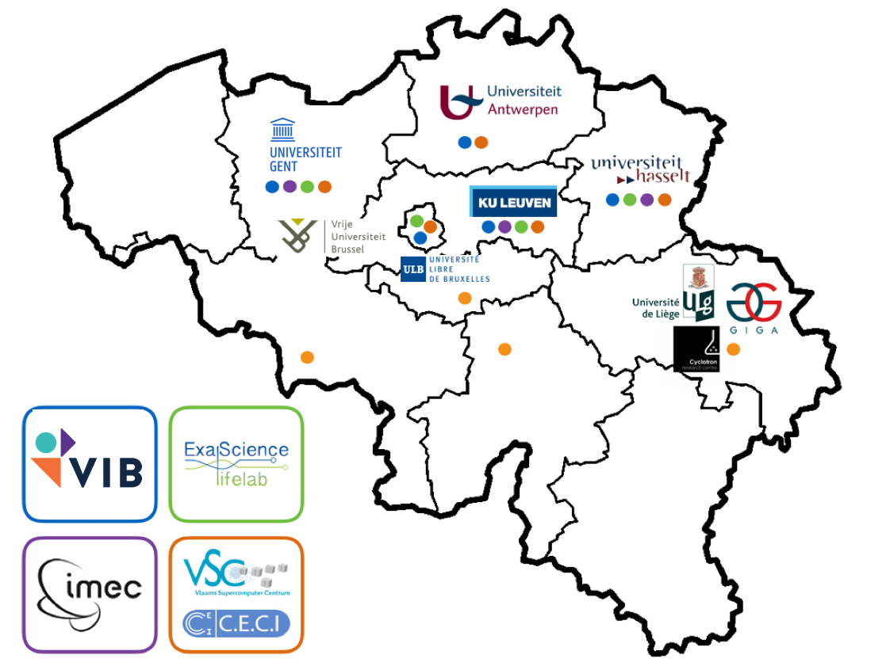

name: title_slide
layout: true
class: right, middle

background-image: url("images/ELIXIR_background.png")
background-position: top
background-repeat: no-repeat
background-size: contain

---

layout: true

---
template: title_slide

# ELIXIR

## Safeguarding life science research data in Europe

### fig**share** fest Belgium 2017

.italic[www.elixir-europe.org]

---

# Outline

### ELIXIR

### ELIXIR Belgium

### Services

### Data management from a user perspective

---

template: title_slide

# ELIXIR: European infrastructure for biological information

---

# European infrastructure for biological information

 | 
---- | ----
Train driver | People !
Train wagon | .highlight[Services]
Train tracks | Hardware

---
class: center, middle

# Data infrastructure for Europe’s life-science research

???

ELIXIR is an intergovernmental organisation that brings together life science resources from across Europe. These resources include databases, software tools, training materials, cloud storage and supercomputers.

The goal of ELIXIR is to coordinate these resources so that they form a single infrastructure. This infrastructure makes it easier for scientists to find and share data, exchange expertise, and agree on best practices. Ultimately, it will help them gain new insights into how living organisms work.

---
class: center, middle

# European-wide effort

---

template: title_slide

# ELIXIR Belgium

---

# Towards a Belgian node

* December 2013 : Memorandum of Understanding, Belgium joins ELIXIR
* November 2015 : ELIXIR Consortium Agreement, full ELIXIR Member
* November 2017 : ELIXIR Collaboration Agreement, bilateral agreements in place

.center[]
.center[Lead institute ELIXIR Belgium]

---
class: center, middle

# Partners of ELIXIR Belgium

---

class: center, middle

# Members of the lead institute

 | 
---- | ----
 Yves Van de Peer | Head of Node
 Frederik Coppens | deputy Head of Node & Technical Coordinator
 Kim De Ruyck | Coordinator ELIXIR Belgium
 Lieven Sterck | Technical Coordinator
 Alexander Botzki | Training Coordinator
 Kristoffer Rapacki | Data Science Cloud Coordinator
 Paula Andrea Martinez | Trainer

 ---

 # Funding

  | 
 ---- | ----
 ELIXIR membership fee | 
 Project Coordinator | 
 ESFRI structural funding |  
 H2020 ELIXIR-Excelerate | 
 ELIXIR projects | 

---

class: center, middle

# Aim of ELIXIR Belgium

### .quote[ to ensure that Belgian researchers can focus on their research question, rather than technical details of data, interoperability, compute resources, … by providing tailored solutions based on an interoperable infrastructure across Europe.]

---

class: center, middle

# Connecting people

## on a national level

### .highlight[Establish a connected bioinformatics community]

* Organize & support events
* Newsletter
* www.elixir-belgium.org
*  @ELIXIRnodeBE

---
class: center, middle

# Connecting people

## internationally

### .highlight[Integrate into the European & international community]

* events by ELIXIR Nodes
* stimulate collaboration
* www.elixir-europe.org
*  @ELIXIREurope

---
class: center, middle

# Connecting people

## between academia and industry

### .highlight[bring together all users of bioinformatics resources]

---
template: title_slide

# Services

---

class: center, middle

# Data infrastructure for Europe’s life-science research

### From Use Cases to Communities
### 3 new Communities: Proteomics, Metabolomics & Galaxy

---

---

<iframe width="800" height="500" src="https://tess.elixir-europe.org/workflows/chip-seq-workflow/embed"></iframe>

---

class: center, middle

