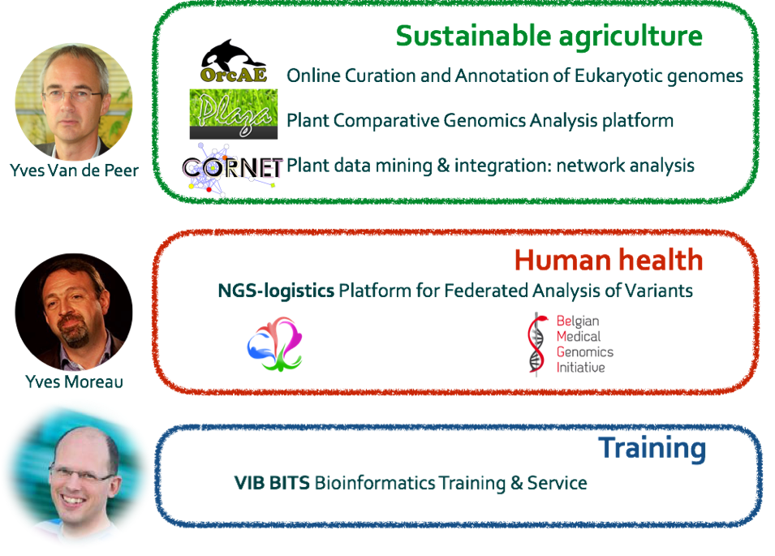

## Towards a Belgian node

* Full member since November 2015 - ELIXIR Consortium Agreement
* ELIXIR membership fee covered by federal government
* Regional government (EWI) funds a project coordinator
* VIB lead institute ELIXIR.BE

Note:
A memorandum of understanding (MOU) was signed in December 2013.
The European Consortium Agreement (ECA) has been signed in November 2015.
Membership fee is based upon the gross national product: 120.000 euro per year for Belgium. Budget is foreseen by BELSPO for following 3 years.
Organization of every node: head of node, …
Currently, we are working on two legal agreements:
1) ELIXIR Collaboration agreement between the ELIXIR Hub and the lead institute (is an annex to the second), and
2) Collaboration agreement between the lead institute and all Belgian partners
First draft has been made by the legal institute of VIB (based on the DESCA format). This draft is currently being reviewed by the EMBL-EBI legal department. Will be send to the other partners soon.

---Section---

## Members of the lead institute:

* Yves Van de Peer
* Frederik Coppens
* Lieven Sterck
* Alexander Botzki
* Kim De Ruyck

Note:
Yves Van de Peer
Professor and group leader of the Bioinformatics and Evolutionary Genomics group. He has ample experience in the fields of gene prediction and genome annotation, comparative and evolutionary genomics, and systems biology.

Frederik Coppens
Project Leader Applied Bioinformatics & Biostatistics group at VIB and IT manager at VIB.
Highly involved in ELIXIR, more specifically in the ELIXIR’s Galaxy working group and the ELIXIR’s Data Management Plans working group. Also involved in the ELIXIR-Excelerate project, participating in WP7 on the Plant Use Case.

Lieven Sterck
Senior researcher in bioinformatics at VIB. Specialized in genome annotation. Involved in the ELIXIR-Excelerate project, participating in WP10 on the Genome Annotation.

Alexander Botzki
Manager of BITS at VIB. Involved in the ELIXIR-Excelerate project, participating in WP11 on Training.

Kim De Ruyck
Responsible for the coordination of the establishment of the Belgian ELIXIR node. Central contact person.

---Section---

---Section---

## Aims

### Connect

### Organize

### Funding

---Section---

## Aim : Connect
Establish connections between bioinformatics groups

* Across academia & industry
* Group visits
* Training meeting September 2016
* Mailing list & newsletter
* Website: www.elixir-belgium.org
* Twitter: @ELIXIRnodeBE

---Section---

## Aim : Organize

* Collaboration Agreements
* Map expertise, specific needs and additional node services
* Project proposals (~ ELIXIR platforms) linking groups similar expertise/needs

---Section---

## Aim : Funds
To extend the Belgian node

Note:
It is all about infrastructure (people in our case!), not research and not funding.
Connect. Started.
Getting organised. Aligned with the 5 basic units in ELIXIR. What are the needs? Were are people struggling with? What makes us unique?
Discuss different topics to come to project proposals over the groups. If common needs or common experience, work towards project proposal.
Project proposal has been submitted for HERCULES in 2014, no funding acquired (although it was positively evaluated). At this moment, the Flemish government is evaluating all ESFRI projects.

---Section---

## Current node services

### Sustainable agriculture

* PLAZA Plant comparative genomics analysis platform
* ORCAE Online curation and annotation of eukaryotic genomes

### Human health

* NGS Logistics Platform for federated analysis of variants

### Trainings & workshops

* VIB Bioinformatics core	Data carpentry, Python, Galaxy, data-management

---Section---

## Beacon

GA4GH Beacons are a discovery service:
which datasets include genomes with allele of interest
ELIXIR pilot project with partners from the Netherlands, Sweden, Finland (and Spain).
Complies to the GA4GH Beacon project standard and security working group policies.
Three objectives:
Provide ELIXIR reference implementation on GA4GH Beacon with 3 authorization levels.
Provide ELIXIR standards for data types
Provide an example on capacity and expertise  build across ELIXIR Nodes to integrate national resources as part of a joint service interface.

---Section---

## SME event

### ELIXIR Innovation and SME forum October ‘17

* Food and Nutrition Data
* Attract companies in probiotics, food, health, …
* Stimulate interaction between companies and the academic partners
* Introduce free tools, data resources and services available through ELIXIR
* Highlight examples of research-intensive companies already making use of big data

ELIXIR Innovation and SME forum on Food and Nutrition Data 
October 9-10 2017, KVS, Brussels

Note:
ELIXIR Belgium will run an Innovation and SME Forum in 2017, focused on the theme of food and nutrition data. Link this event with the OECD meeting organized by EWI. Organisation for Economic Co-operation and Development

---Section---
