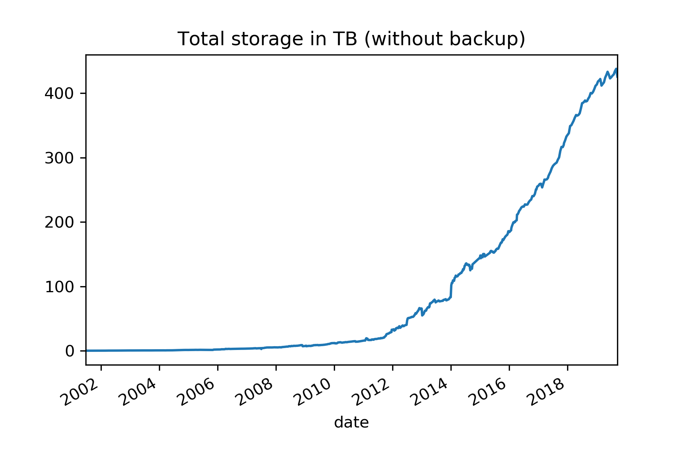

name: title_slide
layout: true
class: right, middle

background-image: url("images/ELIXIR_background.png")
background-position: top
background-repeat: no-repeat
background-size: contain

---
layout: true
name: galaxy_slide

background-color: #2c3143

---

layout: true

---
template: title_slide

## The Data Life Cycle in Practice
## an Infrastructure Point of View

### Frederik Coppens

#### IEEE eScience 2019
#### Workshops on Research Objects 2019

---

# Data in research

---

# Research Data Management to the rescue

### Funding agencies put RDM on the agenda

### Develop policies for Data Life Cycle

### Gathering metadata post-factum is hard

### We need a system to enable **FAIR-by-design**

???

* IT pov
  - if not purposely deleted, the data is on the server
  - not sure where

---

# Infrastructure in Flanders

---

---

# Archiving

RDM == we can do archiving

VIAA BagIt with minimal metadata (Dublin Core)

---

# Need for metadata

Dublin Core
DataCite
not enough

'Scientific metadata': experiment, equipment, parameters, protocols, workflows, ...

---

# ELIXIR Deposition Databases

https://elixir-europe.org/platforms/data/elixir-deposition-databases

---

# CWL

---

---

https://doi.org/10.5281/zenodo.3270823

???
Introduction
Modern (molecular) biology rests on the generation, sharing and integrated analysis of digital data. By connecting the large amounts of digital life-science data, we can foster innovation that, in turn, will allow us to address major societal challenges. For this to succeed, research data and digital services need to be Findable, Accessible, Interoperable, and Reusable (FAIR), allowing both researchers and society at large to fully benefit from public investments in science. Recently, funders also require to submit a Research Data Management (RDM) plan alongside research proposals. The corresponding tasks to achieve this are non-trivial and can be demanding, particularly when undertaken by researchers in isolation and without the benefit of expert advice and tools.
First Mile Research Data Management
Ideally, RDM should be embedded into the research process, making data stewardship and deposition natural parts of the researcher’s workflow. This will enable a shift from making data FAIR for publication as an afterthought, to “FAIR data by design” and will help instil the benefits of FAIR data in the research community. In practice, the implementation of FAIR in local infrastructure is required to describe, format and share data as well as code in a domain-specific way. Alignment with international standards set and/or adopted by e.g. the ELIXIR Deposition Databases for life sciences is important to make this a seamless process for the researcher.
As life-science datasets grow larger and increasingly multidimensional, the re- sources required to store, process and analyse these “big data” frequently outgrow the capabilities of individual researchers and even research institutes. This re- quires re-thinking of the way these needs are met, often involving cloud computing and storage infrastructure, which comes with new challenges in transferring and sharing data as well as keeping track of provenance.
ELIXIR Belgium infrastructure
In the ELIXIR Belgium project, we are setting up a research infrastructure in Flanders to enable researchers to produce FAIR datasets. To ensure long-term preservation of data, we are developing archiving solutions based on Research Objects, specifically the emerging RO-crate format. To ensure adoption, the archiving solutions need to be integrated with our analysis platforms, such as our Galaxy instance (usegalaxy.be). Such analysis platforms need to both be able to consume as generate the appropriate Research Objects, including the appropriate metadata.
In this presentation I will address our plans to develop an end-to-end infras- tructure solution for researchers to make their data FAIR by design. Based on different use cases and user stories, I will touch upon the requirements to package and describe research outputs, from a user-oriented viewpoint.
