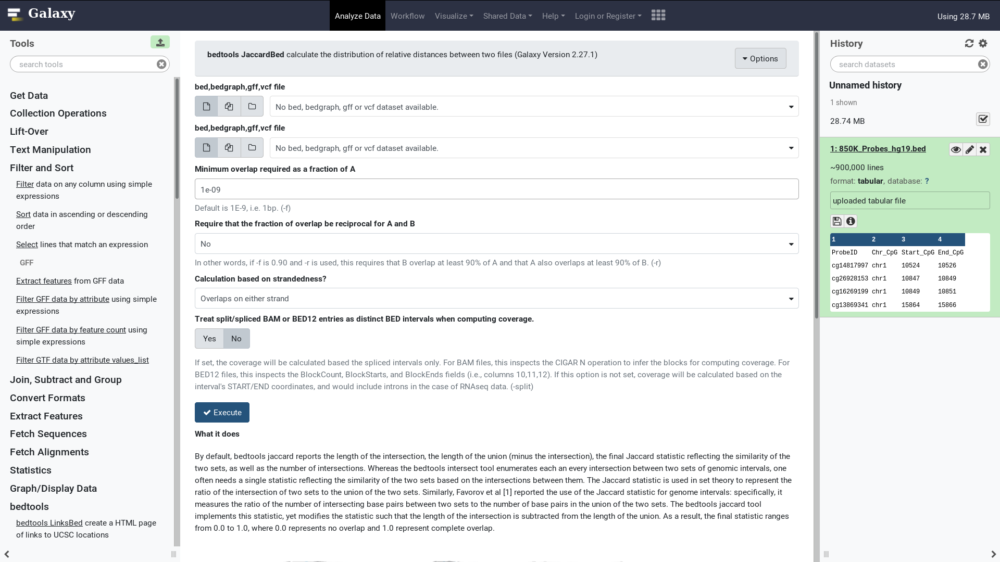
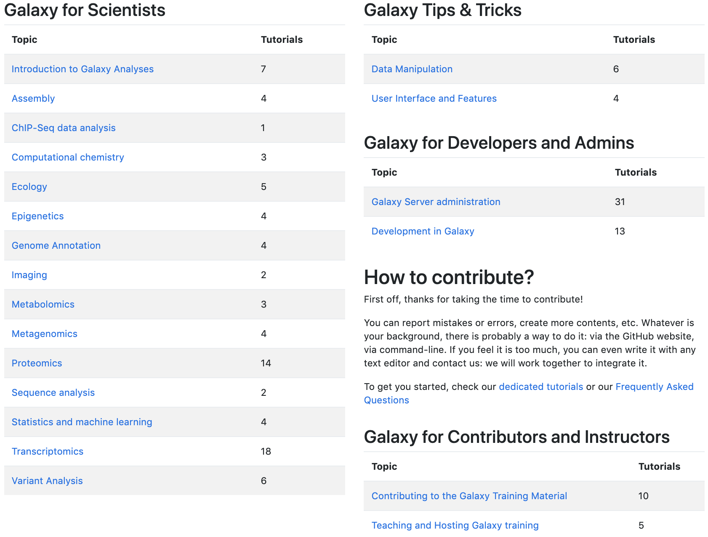
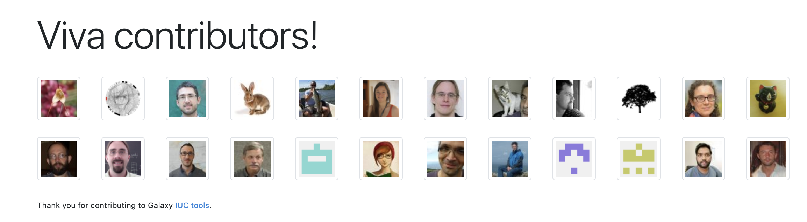
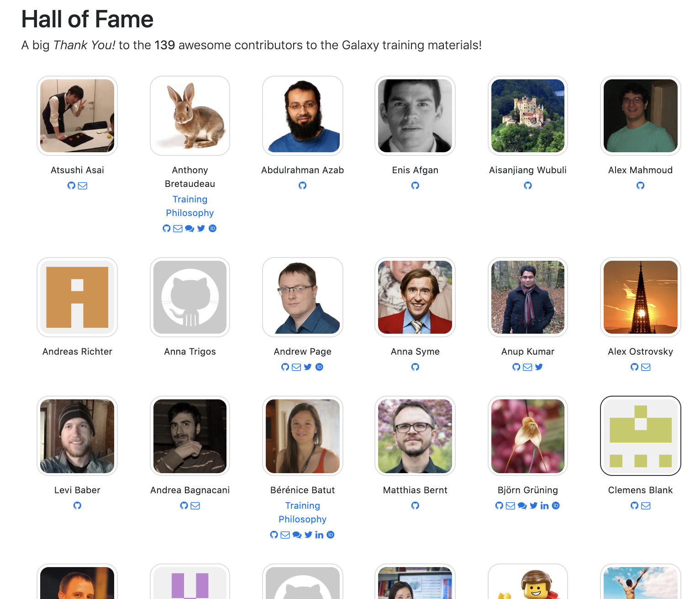

name: title_slide
layout: true
class: right, middle

background-image: url("images/ELIXIR_background.png")
background-position: top
background-repeat: no-repeat
background-size: contain

---
layout: true
name: galaxy_slide

background-color: #2c3143

---

layout: true

---
template: title_slide

## UseGalaxy.be: platform for data-intensive research

### Frederik Coppens

#### ELIXIR Belgium All Hands 2019

---

# European infrastructure for biological information

 | 
---- | ----
 | .highlight[Domain specific Services]
 | Storage Compute Network
  |
???

People !

---

class: center, middle

---
class: center, middle

## Data
## Software
## Analysis workflows

---
template: title_slide

---
class: center, middle

.title[
## Galaxy is an .highlight[open], web-based platform for .highlight[accessible], .highlight[reproducible], and .highlight[transparent] computational biomedical research
]

#usegalaxy @galaxyproject

---
class: center, middle

.title[
## Galaxy enables non-technical users to leverage bioinformatics tools .highlight[themselves] to analyse their data and share results
]
???

* workflow management system
* web-based user-interface
* inherent support for reproducible science
* facilitates sharing of data and results
* removes the need for users to compile and install tools
* allows non-technical users to leverage compute clusters

---
class: center, middle

---

# Galaxy Workflow builder

---
# Get Galaxy

.center[

.remark-code[git clone -b release_18.09 https://github.com/galaxyproject/galaxy.git]

.banner[

## Galaxy is .highlight[open source] and can be .highlight[freely downloaded] for a local installation

]]

---

# usegalaxy.*

### Global collaboration

  #### usegalaxy.eu (Freiburg, Germany)
  #### usegalaxy.org (US)
  #### usegalaxy.org.au (Australia)

### Facilitate reproducible analyses
  - Common core set of tools
  - Common reference data

---
template: title_slide

## UseGalaxy.be: platform for data-intensive research

---

# usegalaxy.*

### Global collaboration

  #### usegalaxy.eu (Germany)
  #### usegalaxy.org (US)
  #### usegalaxy.org.au (Australia)
  #### .highlight[usegalaxy.be] (Belgium)

### Facilitate reproducible analyses
  - Common core set of tools
  - Common reference data

---
class: center, middle

---

# Reference data

#### Genome sequences
#### Annotations
#### Indices for common tools
#### Automation through [ephemeris](https://ephemeris.readthedocs.org/)

### Plant genomes provided by ELIXIR Belgium

---

.center[

.banner[
### 7296 tools wrapped for Galaxy

### [toolshed.g2.bx.psu.edu](https://toolshed.g2.bx.psu.edu)

]

]

---
class: center, middle

#### Thousands of documented and maintained tools

#### Free to use

#### 50 GB for any registered users (5GB for unregistered users)

#### Real time status on https://usegalaxy.be/stats/

### Requests  ?

## galaxy@elixir-belgium.org

---
class: center

.center[]

.banner[
### [training.galaxyproject.org](https://training.galaxyproject.org)
]

???

---

# Community

---

# Future plans

### Provenance
### Expand portfolio of tools
### Integration with data management platforms
### Further facilitate interoperability & re-use

---

# Acknowledgements

 | 
---- | ----
   | <ul><li>**Ignacio Eguinoa**</li> <li>Bert Droesbeke</li> <li>Michiel Van Bel</li></ul>
   | <ul><li>**Björn Grüning**</li> <li> Helena Rasche</li> <li>Bérénice Batut</li></ul>
   | <ul><li>James Taylor</li> <li>Anton Nekrutenko</li></ul>
   | <ul><li>Álvaro Simon Garcia</li> <li>Stijn De Weirdt</li></ul>

---
class: center, middle

