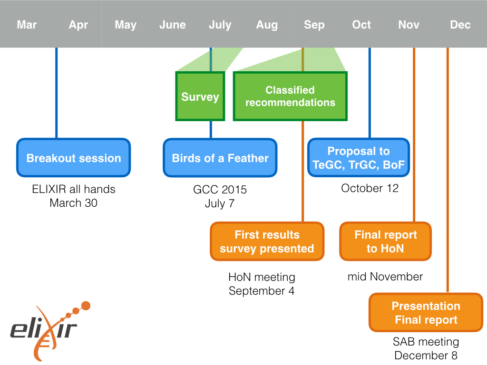

name: title_slide
layout: true
class: right, middle

background-image: url("images/ELIXIR_background.png")
background-position: top
background-repeat: no-repeat
background-size: contain

---

layout: true

---
template: title_slide

## ELIXIR Galaxy Community

### Frederik Coppens

#### Galaxy User Conference, March 15-16 2018, Freiburg

.italic[www.elixir-europe.org]

[https://frederikcoppens.github.io/slidedecks/](https://frederikcoppens.github.io/slidedecks/)

---
template: title_slide

# ELIXIR Galaxy Community

## facilitating data analysis in life sciences at European level

---

# Outline

### The Galaxy Working group

### A user centric approach

### A reincarnation: from WG to Community

---
template: title_slide

# ELIXIR Galaxy Working Group

## Recommendations document

by Manuel Corpas, Frederik Coppens & the ELIXIR Galaxy community

---

## The process

---

## Conclusions Survey

* Broad usage of Galaxy in the ELIXIR community
* Many small local instances
* Few resources for maintenance
* Main goal: Enable biologists to perform data intensive (NGS) analyses

---

## Goals

* Building a European / ELIXIR Galaxy community
* Integrate ELIXIR services into Galaxy
* Training for users, developers and administrators
* Development of the Galaxy Platform

---

## Activities on Training

* January 2017 : European Galaxy Developers in Strasbourg, France
* May 2017 : ELIXIR/GOBLET/GTN hackathon for Galaxy training material re-use in Cambridge, UK
* January 2018 : European Admin Workshop in Oslo, Norway

[https://www.elixir-europe.org/about/groups/galaxy-wg](https://www.elixir-europe.org/about/groups/galaxy-wg)

---
template: title_slide

# A reincarnation

# Working Group to Community

---

## Working Group to Community

### September 2017

* From a temporary WG
* To an ELIXIR Community
* Part of the Tools platform
* Co-chairing with Björn Grüning (Freiburg) and Gildas Le Corguillé (Roscoff)

---

## Working Group to Community

### Why ?

* Annual meeting supported by ELIXIR
* Suggest & submit projects to ELIXIR Europe

### Facilitating data analysis

* Access to Data
* Sharing of workflows
* Training at all levels

---

# ELIXIR Galaxy Community

.center[]

---

# ELIXIR Galaxy Community

* A European network of Galaxy communities
* Visualisation in Galaxy
* Galaxy cloud infrastructure across Europe
* Data access & integration in Galaxy
* Bringing Tools and Data together
* Training
* FAIR data, tools, workflows & Galaxy

---

class: center, middle

