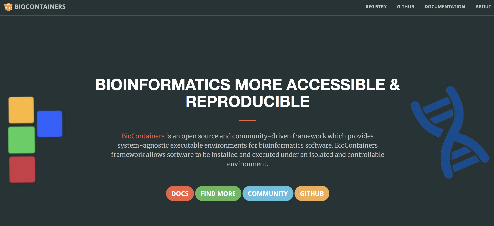
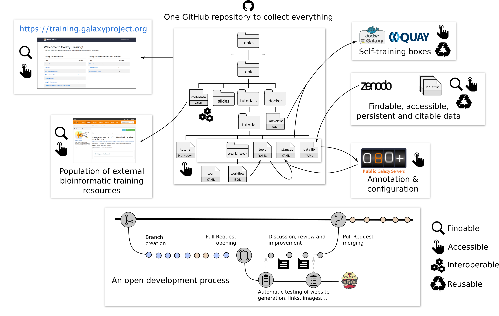

name: title_slide
layout: true
class: right, middle

background-image: url("images/ELIXIR_background.png")
background-position: top
background-repeat: no-repeat
background-size: contain

---
layout: true
name: galaxy_slide

background-color: #2c3143

---

layout: true

---
template: title_slide

## The ELIXIR Galaxy Community

### Frederik Coppens

#### 12th CeBiTec Symposium - Big Data in Medicine and Biotechnology

.italic[www.elixir-europe.org]

???

[https://frederikcoppens.github.io/slidedecks/](https://frederikcoppens.github.io/slidedecks/)

---
template: title_slide

# ELIXIR Galaxy Community

## facilitating data analysis in life sciences at European level

---

# Outline

### Galaxy, a platform for data-intensive analysis

### ELIXIR Galaxy Working Group to Community

### Community : planning for the future

### ELIXIR Galaxy Infrastructure

---
template: title_slide

# Galaxy

## user-friendly platform for data-intensive analysis

---

.center[]

* workflow management system   
* web-based user-interface
* inherent support for reproducible science
* facilitates sharing of data and results
* removes the need for users to compile and install tools

### Galaxy is available as a world-wide free-to-use online portal, and can be freely downloaded for a local installation.

---

.center[]

.center[ https://usegalaxy.org]

---

# Workflows

.center[]

---
template: title_slide

# ELIXIR Galaxy Working Group to Community

## Recommendations document

by Manuel Corpas, Frederik Coppens & the ELIXIR Galaxy community

---

# The process

---

# Conclusions Survey

* Broad usage of Galaxy in the ELIXIR community
* Many small local instances
* Few resources for maintenance
* Main goal: Enable biologists to perform data intensive (NGS) analyses

---

# Goals

* Building a European / ELIXIR Galaxy community
* Integrate ELIXIR services into Galaxy
* Training for users, developers and administrators
* Development of the Galaxy Platform

---

# Activities on Training

* January 2017 : European Galaxy Developers, Strassbourg, France
* May 2017 : ELIXIR/GOBLET/GTN hackathon for Galaxy training material re-use, Cambridge, UK
* January 2018 : European Administrator Workshop, Oslo, Norway

[https://www.elixir-europe.org/about/groups/galaxy-wg](https://www.elixir-europe.org/about/groups/galaxy-wg)

---

# Working Group to Community

### September 2017

* From a temporary WG to an ELIXIR Community
* Part of the Tools platform
* Co-chairing with
  * Björn Grüning (Freiburg, de.NBI)
  * Gildas Le Corguillé (Roscoff, ELIXIR-FR)

---

template: title_slide

# ELIXIR Galaxy Community

---

# ELIXIR Galaxy Community

.center[]

---

# ELIXIR Galaxy Community

* Bringing Tools and Data together
* FAIR data, tools, workflows & Galaxy
* Training
* Data access & integration in Galaxy
* Galaxy cloud infrastructure across Europe
* A European network of Galaxy communities

---

# Links to other communities

### NGS

### Metabolomics  

### Proteomics 

### Metagenomics

### Microbial

### Plant

### Genome annotation

---

# Towards FAIR

### Tools

### Workflows

### Data

### Training materials

### ...

---
template: galaxy_slide

.center[]

---

# Tools packaging & dependencies

.center[]

???

* Programming language agnostic
* OS independent
* No root privileges needed
* Management of multiple version
* HPC and Cloud compatible
* Easy to maintain

---

# Tools & Services Registry

.center[ https://bio.tools
]

.center[[ReGaTE: Registration of Galaxy Tools in ELIXIR](https://www.ncbi.nlm.nih.gov/pubmed/28402416)]

---

# Containers

.center[]

---

# Software deployment

.center[ https://biocontainers.pro/ ]

---

# Future focus areas

## Workflows

* Agnostic repository improvements e.g. myExperiment
* Facilitate sharing between Galaxy instances

## Data

* Facilitate access to data in public repositories
* Container based sensitive data setup

---

template: title_slide

# ELIXIR Galaxy Infrastructure

---

# Galaxy Training Infrastructure

* Interactive learning platform
* Support for current research problems
* Effective training for individual users & instructors
* Community driven (content creation and maintenance)
* Convenient, hassle-free tutorial creation
* Enables transparent peer-review and curation
* FAIR: Findable, Accessible, Interoperable, Reusable
* Open

---

# Galaxy Training Infrastructure

.center[
[Bérénice Batut](https://github.com/bebatut/talks/tree/master/18/03_16_galaxy_user_conf)]

---

# Galaxy Training Infrastructure

.center[ https://training.galaxyproject.org]

---

# Training eSupport System

* Disseminate, discover & package training resources, training materials and events
* Aggregating information from ELIXIR nodes and 3rd-party content providers

.center[[https://tess.elixir-uk.org](https://tess.elixir-uk.org)]

---
template: title_slide

# Towards an integrated data analysis infrastructure

---
template: galaxy_slide

.center[]

---

.center[]

* Launched March 15, 2018
* Thousands of documented and maintained tools
* Free registration
* 250 GB per user
* Training capacities on demand and online (Training Infrastructure as a Service)

.center[ ]

---

# Towards a federation of Galaxies

* Link instances across the globe
* Minimal requirements: enable all training materials
* Workload located based on your affiliation
* Facilitates sharing Workflows
* Rapid access to new developments
* Easier maintenance of servers
* ...

---

# ELIXIR Galaxy Community

.center[]

???

https://conda.io/docs/

---

class: center, middle

# Thank you

---

template: title_slide

## The ELIXIR Galaxy Community

### Björn Grüning, Gildas Le Corguillé, Frederik Coppens

#### 12th CeBiTec Symposium - Big Data in Medicine and Biotechnology

.italic[www.elixir-europe.org]
