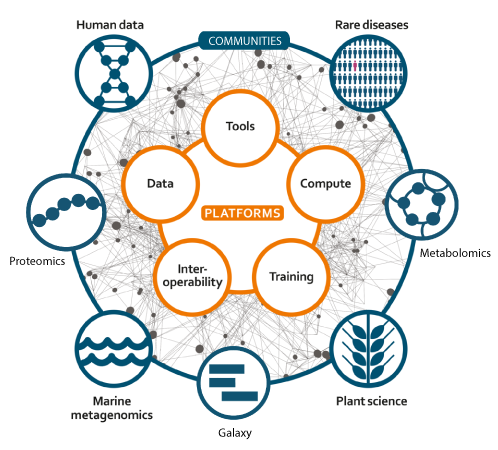
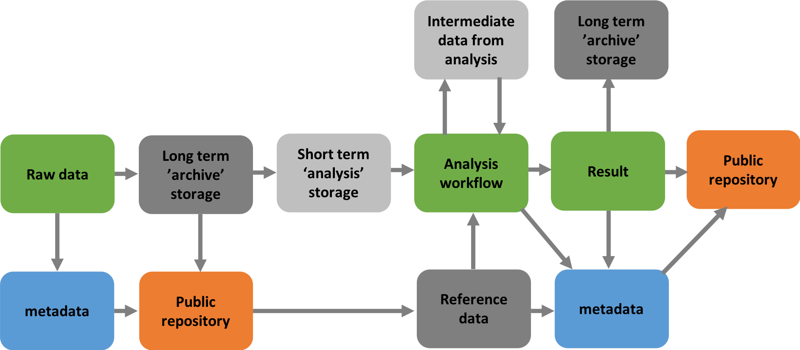
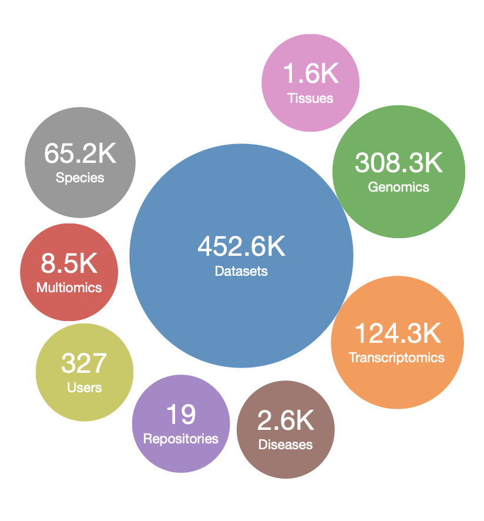
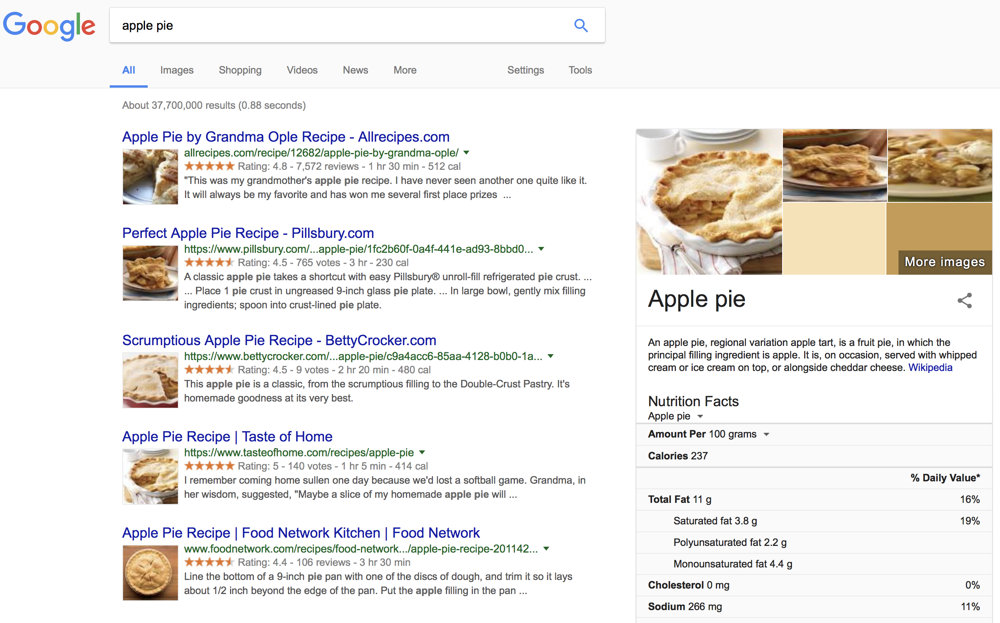
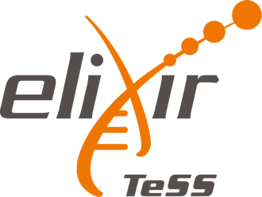
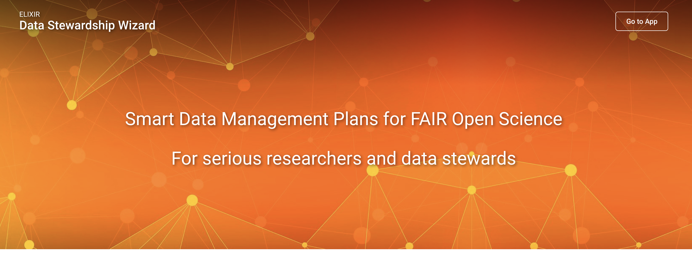
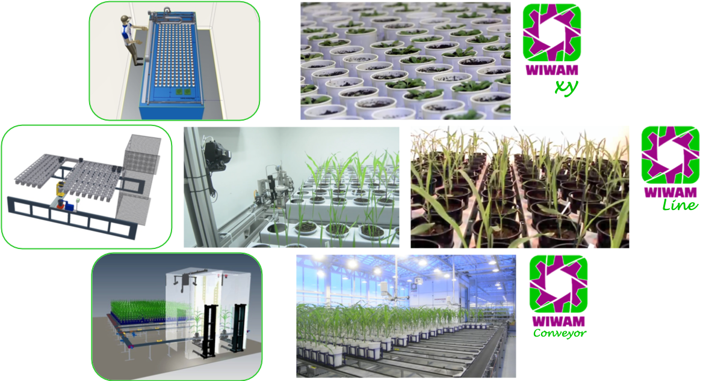
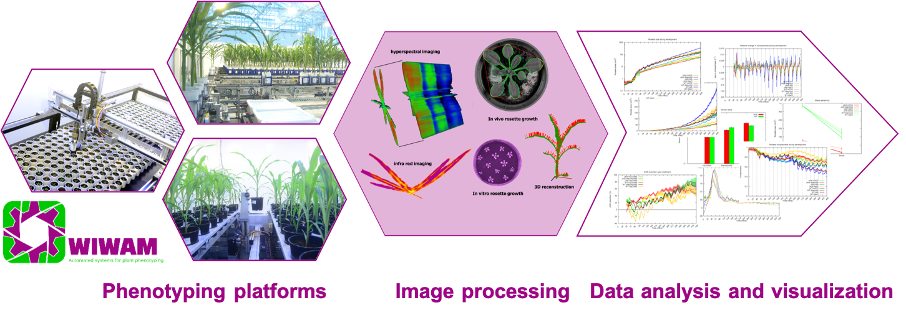
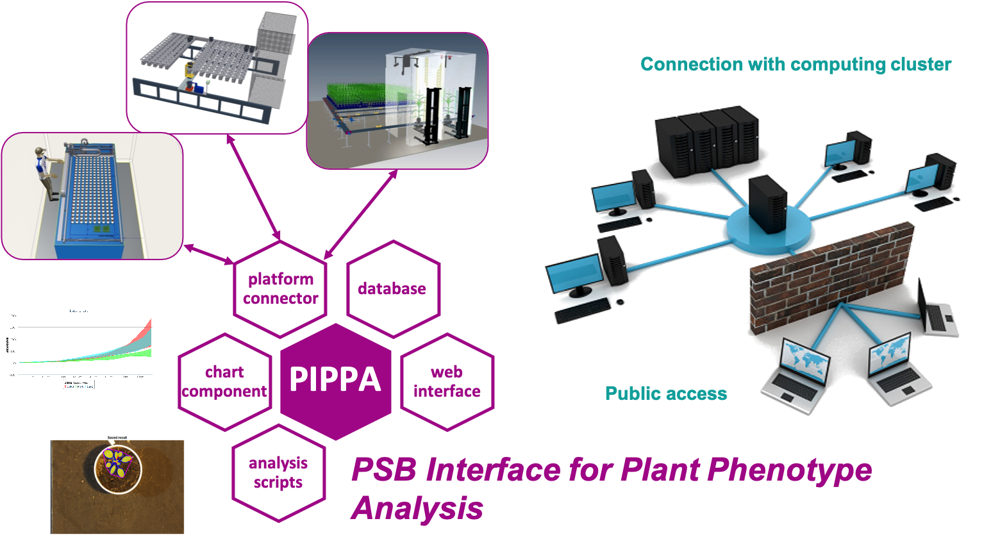
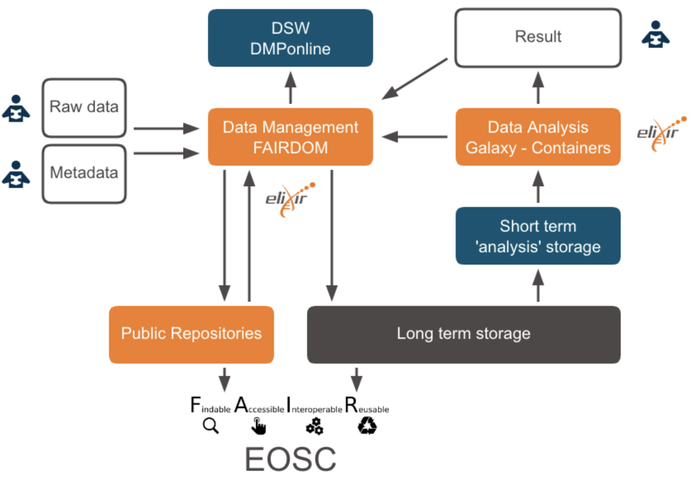

name: title_slide
layout: true
class: right, middle

background-image: url("images/ELIXIR_background.png")
background-position: top
background-repeat: no-repeat
background-size: contain

---
layout: true
name: galaxy_slide

background-color: #2c3143

---

layout: true

---
template: title_slide

## FAIR data, tools and workflows:   a user perspective

### Frederik Coppens

#### NETTAB 2018 - Building a FAIR Bioinformatics environment

.italic[www.elixir-europe.org]

---

# Outline

### ELIXIR: European infrastructure for biological information

### Open Science, Open Data & Research Data Management

### ELIXIR Services

### Infrastructure for Open Science

---

template: title_slide

# ELIXIR: European infrastructure for biological information

---

# European infrastructure for biological information

 |  | 
---- | ---- | ----
 | .highlight[Domain specific Services] | ESFRIs
 | Storage, Compute, Network | e-Infrastructures

---
class: center, middle

# Data infrastructure for Europe’s life-science research

???

ELIXIR is an intergovernmental organisation that brings together life science resources from across Europe. These resources include databases, software tools, training materials, cloud storage and supercomputers.

The goal of ELIXIR is to coordinate these resources so that they form a single infrastructure. This infrastructure makes it easier for scientists to find and share data, exchange expertise, and agree on best practices. Ultimately, it will help them gain new insights into how living organisms work.

---

class: center, middle

# European-wide effort

---
template: title_slide

# Open Science, Open Data & Research Data Management

---
class: center, middle

# The theory

---
# Issues with the theory for researchers

* What should be in a Data Management Plan ?
* Gathering data ? What to gather ?
* What is metadata ? Never heard of...
* Which repository to choose ?
* How to deposit (large amounts of) data ?
* What is OpenAire ?

---
class: center, middle

# In practice

---
template: title_slide

# ELIXIR Services

---
class: center, middle

# ELIXIR Services

---

class: center, middle

# Data infrastructure for Europe’s life-science research

---

# FAIR Data Position Paper

1. .highlight[Open sharing of research data is a core principle] for publicly-funded research and ELIXIR encourages   all   funders   to   adopt   Open   Data   mandates.
2. .highlight[Data   Management   is   crucial]   part   of   good   scientific   practice   and   research   excellence.
3. Whenever possible, biological research data should be submitted to the recommended
community   .highlight[deposition   databases].
4. All data submitted to Open Data archives must be .highlight[annotated] in accordance with
.highlight[community-defined  standards].
5. .highlight[ELIXIR Nodes] are the national implementation of a harmonised FAIR Data Management
programme   for   the   life   sciences.
6. FAIR   data   management   requires   .highlight[professional   skills]   and   adequate   resources.
7. Good   research   data   management   requires   appropriate   .highlight[funding   for   data   infrastructures].

[https://www.elixir-europe.org/news/position-paper-fair-data-management](https://www.elixir-europe.org/news/position-paper-fair-data-management)

---

# Data Platform

### Deposition Databases for Biomolecular Data

 | 
---- | ----
ArrayExpress | Functional genomics data
BioModels	| Computational models of biological processes
EGA	| Genetic and phenotypic data from biomedical research projects
ENA | Nucleotide sequence information
IntAct	| Molecular interaction data
MetaboLights	| Experimental metabolomics data
PDBe	| Biological macromolecular structures
PRIDE	| Mass spectrometry-based proteomics data

https://www.elixir-europe.org/platforms/data/elixir-deposition-databases

---

# Data Platform

### ELIXIR Core Data Resources

#### Fundamental importance to the wider life-science community
#### Long-term preservation of biological information
#### Ensure sustainability

Examples:

* European Nucleotide Archive (ENA)
* Europe PubMed Central
* Human Protein Atlas

https://www.elixir-europe.org/platforms/data/core-data-resources

---

# Beacons

.highlight[Drive implementation of the Beacon technology within ELIXIR nodes]

ELIXIR Authentication and Authorisation Infrastructure

  | 
---- | ----
Public | Accessible to internet users
Registered  | Accessible to bona fide researchers
Controlled  | Authorized, signed agreement needed

---

# OmicsDI

* Omics Discovery Index
* integrated and open source platform
* facilitating the access and dissemination of omics datasets
  - proteomics
  - genomics
  - transcriptomics
  - metabolomics

###  [www.omicsdi.org](https://www.omicsdi.org)

---
class: center

# OmicsDI

---

# Interoperability Platform

### BioSchemas.org

* .highlight[Schema.org] semantic markup of webpages
* collection of specifications that provide guidelines for markup within life sciences
* Generic service as part of the European Open Science Cloud

.center[]

---

# BioSchemas.org

.center[]

---

# Training eSupport System

* Disseminate, discover & package training resources, training materials and events
* Aggregating information from ELIXIR nodes and 3rd-party content providers

[https://tess.elixir-uk.org](https://tess.elixir-uk.org)

---

# FAIRsharing.org

(formerly BioSharing.org)

.center[]

???

Ontology lookup service
Identifiers.org

---
class: center, middle

# In practice

---
# Tools Platform

.quote[improve the discovery, quality and sustainability of software resources]

#### Tools and services registry
#### Scientific benchmark and technical monitoring
#### Software deployment
#### Workflows and workbenches
#### Software best practices

[Jiménez et al. Four simple recommendations to encourage best practices in research software. F1000Research 2017, 6:876](http://dx.doi.org/10.12688/f1000research.11407.1)

#### Tools interoperability (e.g. Common Workflow Language)

---

# Tools & Services Registry

https://bio.tools

.center[]

???

---
class: center,middle

# Workflows

---

# Galaxy

https://usegalaxy.org

---

# ELIXIR Galaxy Community

.center[]

Co-chairing with Björn Grüning (de.NBI, ELIXIR Germany) and Gildas Le Corguillé (IFB, ELIXIR France)

???

* A European network of Galaxy communities
* Visualisation in Galaxy
* Galaxy cloud infrastructure across Europe
* Data access & integration in Galaxy
* Bringing Tools and Data together
* Training
* FAIR and Galaxy

---

# Software deployment

https://biocontainers.pro/

.center[]

.center[]

---
class: center, middle

# In practice

---

# Data Management WG

### Data Stewardship Wizard

.center[]

* Build a network of Data Stewards
* Smart questionnaire
* https://dsw.fairdata.solutions/

---

# DMPonline

???

* Online wizard for Data Management Plans
* Internationally used open source software
* Template based
*
---

# Robotic phenotyping platforms @ VIB

.center[]

* Designed and built in collaboration with machine building company - SMO
* [www.wiwam.com](https://www.wiwam.com)

---

# Plant Phenotyping Data management

.center[]

---

# Plant Phenotyping Data management

.center[

]
---

# FAIRDOMHub

???

* Online portal
* Template based: adaptable to domain specific needs
* Integration with analysis platforms possible
* Goal: central portal in Data Life Cycle
* Setting up collaboration within ELIXIR Nodes (H2020 INFRADEV-03)
* Work Package in FWO IRI call ELIXIR Belgium
* EWI project ‘Implementing EOSC: ESFRI driven Open Science’

---
template: title_slide

# Infrastructure for Open Science

---

## Infrastructure for Open Science

* Data: input, intermediate & results
* Tools & workflows
* All associated metadata
* Infrastructure to
  - Store
  - Analyse
  - Publish / share
* Data Management Platform

---

## Infrastructure for Open Science

---

.right[]

### Data infrastructure for Europe’s life-science research

### Life-science gateway for the European Open Science Cloud

### Broadly applicable solutions for common challenges

### FAIR at the Core

---

.right[]

# Challenge

### Organize local data & metadata, compatible with daily research and publishing practices

---
class: center, middle

