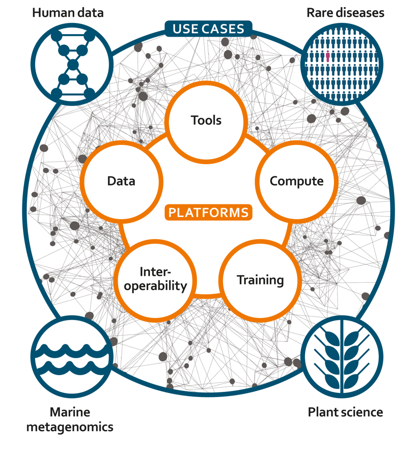
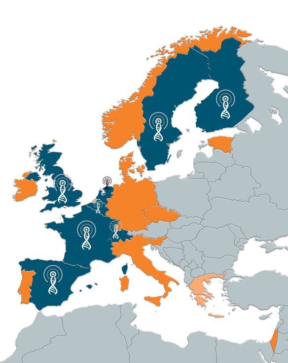
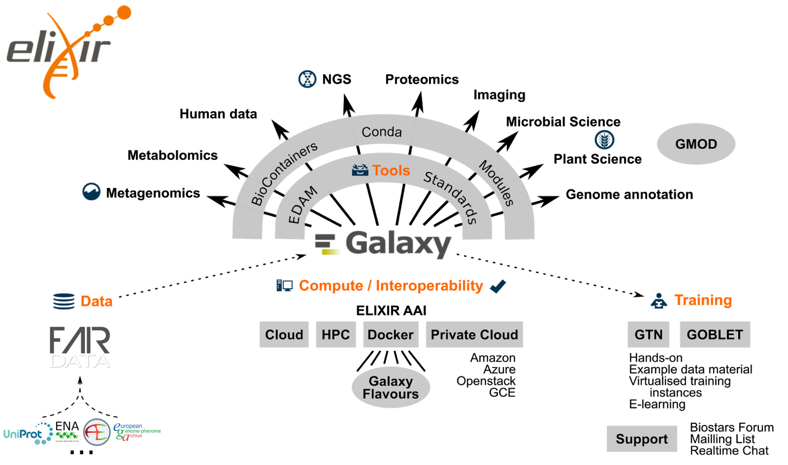

name: title_slide
layout: true
class: right, middle

background-image: url("images/ELIXIR_background.png")
background-position: top
background-repeat: no-repeat
background-size: contain

---
layout: true
name: galaxy_slide

background-color: #2c3143

---

layout: true

---
template: title_slide

## FAIR data, tools and workflows: a user perspective

### Frederik Coppens

#### NETTAB 2018 - Building a FAIR Bioinformatics environment

.italic[www.elixir-europe.org]

???

[https://frederikcoppens.github.io/slidedecks/](https://frederikcoppens.github.io/slidedecks/)

The goal to move towards a more Open Science environment has inspired funders and institutes to e.g. include data management plans and open access publication into grant requirements. To also ensure reproducibility in bioinformatics, the whole data analysis chain needs to taken into account, from input and reference data over tools and workflows to results. While this is a positive evolution it also confronts researchers with a number of challenges. These are largely in the realm of infrastructure, therefore we need to ensure that researchers have access to tools and services that can help them meet these challenges.
I will highlight a number of challenges users have to deal with and the solutions ELIXIR is working on to enable FAIR data, tools and workflows.

---

SLIDES TO BE ADAPTED

---

# Outline

### ELIXIR: European infrastructure for biological information

### ELIXIR Belgium

### Open Science, Open Data & Research Data Management

### ELIXIR Services: from an data management point of view

### The Open Science infrastructure puzzle

---

template: title_slide

# ELIXIR: European infrastructure for biological information

---

# European infrastructure for biological information

 |  | 
---- | ---- | ----
 | .highlight[Domain specific Services] | ESFRIs
 | Storage, Compute, Network | e-Infrastructures

???

People !

---
class: center, middle

# Data infrastructure for Europe’s life-science research

???

ELIXIR is an intergovernmental organisation that brings together life science resources from across Europe. These resources include databases, software tools, training materials, cloud storage and supercomputers.

The goal of ELIXIR is to coordinate these resources so that they form a single infrastructure. This infrastructure makes it easier for scientists to find and share data, exchange expertise, and agree on best practices. Ultimately, it will help them gain new insights into how living organisms work.

---
class: center, middle

# European-wide effort

---

template: title_slide

# ELIXIR Belgium

---
class: center, middle

# Partners of ELIXIR Belgium

---

class: center, middle

# Members of the lead institute

 | 
---- | ----
 Yves Van de Peer | Head of Node
 Frederik Coppens | deputy Head of Node & Technical Coordinator
 Kim De Ruyck | Coordinator ELIXIR Belgium
 Lieven Sterck | Technical Coordinator
 Alexander Botzki | Training Coordinator
 Paula Andrea Martinez | Trainer

---

class: center, middle

# Aim of ELIXIR Belgium

### .quote[ to ensure that Belgian researchers in life sciences can focus on their research question, rather than technical details of data, interoperability, compute resources, … by providing tailored solutions based on an interoperable infrastructure across Europe.]

---
template: title_slide

# Open Science, Open Data & Research Data Management

---
class: center, middle

# The theory

---
# Issues with the theory for researchers

* What should be in a Data Management Plan ?
* Gathering data ? What to gather ?
* What is metadata ? Never heard of...
* Which repository to choose ?
* How to deposit (large amounts of) data ?
* What is OpenAire ?

---
class: center, middle

# In practice

---
template: title_slide

# ELIXIR Services

---
class: center, middle

# ELIXIR Services

---

class: center, middle

# Data infrastructure for Europe’s life-science research

New Communities: Proteomics, Metabolomics, Galaxy

---

# FAIR Data Position Paper

1. .highlight[Open sharing of research data is a core principle] for publicly-funded research and ELIXIR encourages   all   funders   to   adopt   Open   Data   mandates.
2. .highlight[Data   Management   is   crucial]   part   of   good   scientific   practice   and   research   excellence.
3. Whenever possible, biological research data should be submitted to the recommended
community   .highlight[deposition   databases].
4. All data submitted to Open Data archives must be .highlight[annotated] in accordance with
.highlight[community-defined  standards].
5. .highlight[ELIXIR Nodes] are the national implementation of a harmonised FAIR Data Management
programme   for   the   life   sciences.
6. FAIR   data   management   requires   .highlight[professional   skills]   and   adequate   resources.
7. Good   research   data   management   requires   appropriate   .highlight[funding   for   data   infrastructures].

[https://www.elixir-europe.org/news/position-paper-fair-data-management](https://www.elixir-europe.org/news/position-paper-fair-data-management)

---

# Data Platform

### Deposition Databases for Biomolecular Data

 | 
---- | ----
ArrayExpress | Functional genomics data
BioModels	| Computational models of biological processes
EGA	| Genetic and phenotypic data from biomedical research projects
ENA | Nucleotide sequence information
IntAct	| Molecular interaction data
MetaboLights	| Experimental metabolomics data
PDBe	| Biological macromolecular structures
PRIDE	| Mass spectrometry-based proteomics data

https://www.elixir-europe.org/platforms/data/elixir-deposition-databases

---

# Data Platform

### ELIXIR Core Data Resources

#### Fundamental importance to the wider life-science community
#### Long-term preservation of biological information
#### Ensure sustainability

Examples:

* European Nucleotide Archive (ENA)
* Europe PubMed Central
* Human Protein Atlas

https://www.elixir-europe.org/platforms/data/core-data-resources

---

# Beacons

.highlight[Drive implementation of the Beacon technology within ELIXIR nodes]

ELIXIR Authentication and Authorisation Infrastructure

  | 
---- | ----
Public | Accessible to internet users
Registered  | Accessible to bona fide researchers
Controlled  | Authorized, signed agreement needed

---

# Interoperability Platform

.quote[ELIXIR encourages the life science community to adopt standardised file formats, metadata, vocabularies and identifiers.]

#### FAIR principles

#### Metadata: annotation & ontologies

#### Value proposition: return on investment for stakeholder

---

# BioSchemas.org

* .highlight[Schema.org] semantic markup of webpages
* collection of specifications that provide guidelines for markup within life sciences
* Generic service as part of the European Open Science Cloud

.center[]

---

# BioSchemas.org

.center[]

---

# Training eSupport System

* Disseminate, discover & package training resources, training materials and events
* Aggregating information from ELIXIR nodes and 3rd-party content providers

[https://tess.elixir-uk.org](https://tess.elixir-uk.org)

---

# FAIRsharing.org

(formerly BioSharing.org)

.center[]

???

Ontology lookup service
Identifiers.org

---
class: center, middle

# In practice

---
# Tools Platform

.quote[improve the discovery, quality and sustainability of software resources]

#### Tools and services registry
#### Scientific benchmark and technical monitoring
#### Software deployment
#### Workflows and workbenches
#### Software best practices

[Jiménez et al. Four simple recommendations to encourage best practices in research software. F1000Research 2017, 6:876](http://dx.doi.org/10.12688/f1000research.11407.1)

#### Tools interoperability (e.g. Common Workflow Language)

---

# Tools & Services Registry

https://bio.tools

.center[]

???

---

# Workflows

workflow registry  

---

# Galaxy

https://usegalaxy.org

---

# Galaxy @ VSC

Server in Beta testing on VSC Cloud infrastructure : [https://www.usegalaxy.be](https://www.usegalaxy.be)

---

# ELIXIR Galaxy Community

.center[]

Co-chairing with Björn Grüning (de.NBI, ELIXIR Germany) and Gildas Le Corguillé (IFB, ELIXIR France)

???

* A European network of Galaxy communities
* Visualisation in Galaxy
* Galaxy cloud infrastructure across Europe
* Data access & integration in Galaxy
* Bringing Tools and Data together
* Training
* FAIR and Galaxy

---

# Software deployment

https://biocontainers.pro/

.center[]

.center[]

---
class: center, middle

# In practice

---

# Data Management WG

#### Build a network of Data Stewards
#### Provide a checklist
#### Complementary to DMPonline

### Data Stewardship Wizard

Work in progress:  https://dmp.fairdata.solutions

.center[]

---

# DMPonline.be

???

* Online wizard for Data Management Plans
* Internationally used open source software
* Based on templates
  - FWO
  - H2020
  - ...
* Managed by DMPbelgium consortium

---

# FAIRDOMHub

???

* Online portal
* Template based: adaptable to domain specific needs
* Integration with analysis platforms possible
* Goal: central portal in Data Life Cycle
* Setting up collaboration within ELIXIR Nodes (H2020 INFRADEV-03)
* Work Package in FWO IRI call ELIXIR Belgium
* EWI project ‘Implementing EOSC: ESFRI driven Open Science’

---

# The Open Science infrastructure puzzle

* Data: input, intermediate & results
* Tools & workflows
* All associated metadata
* Infrastructure to
  - Store
  - Analyse
  - Publish / share
* Data Management Platform

---

# The Open Science infrastructure puzzle

---

.right[]

#### Data infrastructure for Europe’s life-science research

#### Life-science gateway for the European Open Science Cloud

#### Broadly applicable solutions for common challenges

#### FAIR at the Core

* Data
* Metadata
* Tools & Services
* Analysis workflows
* ...

---

.right[]

# Challenge

### Organize local data & metadata, compatible with daily research and publishing practices

---

# Upcoming Training ELIXIR Belgium

### Public proteomics data reprocessing and the Tabloid Proteome

#### 10 October 2018, from 9h30 to 17h00, Ghent

* Introduction to Public Proteomics resources and tools
* Practical: Reprocessing MS data from PRIDE
* Tabloid Proteome: a use case of public proteomics data re-use
* Practical: Investigating protein association using Tabloid Proteome database

#### https://www.elixir-belgium.org/training
#### https://tess.elixir-europe.org/ search 'proteomics'

---

class: center, middle

---

.center[]

* workflow management system
* web-based user-interface
* inherent support for reproducible science
* facilitates sharing of data and results
* removes the need for users to compile and install tools

### Galaxy is available as a world-wide free-to-use online portal, and can be freely downloaded for a local installation.

---

.center[]

.center[ https://usegalaxy.org]

---

# Workflows

.center[]

---
template: title_slide

# ELIXIR Galaxy Working Group to Community

## Recommendations document

by Manuel Corpas, Frederik Coppens & the ELIXIR Galaxy community

---

# The process

---

# Conclusions Survey

* Broad usage of Galaxy in the ELIXIR community
* Many small local instances
* Few resources for maintenance
* Main goal: Enable biologists to perform data intensive (NGS) analyses

---

# Goals

* Building a European / ELIXIR Galaxy community
* Integrate ELIXIR services into Galaxy
* Training for users, developers and administrators
* Development of the Galaxy Platform

---

# Activities on Training

* January 2017 : European Galaxy Developers, Strassbourg, France
* May 2017 : ELIXIR/GOBLET/GTN hackathon for Galaxy training material re-use, Cambridge, UK
* January 2018 : European Administrator Workshop, Oslo, Norway

[https://www.elixir-europe.org/about/groups/galaxy-wg](https://www.elixir-europe.org/about/groups/galaxy-wg)

---

# Working Group to Community

### September 2017

* From a temporary WG to an ELIXIR Community
* Part of the Tools platform
* Co-chairing with
  * Björn Grüning (Freiburg, de.NBI)
  * Gildas Le Corguillé (Roscoff, ELIXIR-FR)

---

template: title_slide

# ELIXIR Galaxy Community

---

# ELIXIR Galaxy Community

.center[]

---

# ELIXIR Galaxy Community

* Bringing Tools and Data together
* FAIR data, tools, workflows & Galaxy
* Training
* Data access & integration in Galaxy
* Galaxy cloud infrastructure across Europe
* A European network of Galaxy communities

---

# Links to other communities

### NGS

### Metabolomics  

### Proteomics 

### Metagenomics

### Microbial

### Plant

### Genome annotation

---

# Towards FAIR

### Tools

### Workflows

### Data

### Training materials

### ...

---
template: galaxy_slide

.center[]

---

# Tools packaging & dependencies

.center[]

???

* Programming language agnostic
* OS independent
* No root privileges needed
* Management of multiple version
* HPC and Cloud compatible
* Easy to maintain

---

# Tools & Services Registry

.center[ https://bio.tools
]

.center[[ReGaTE: Registration of Galaxy Tools in ELIXIR](https://www.ncbi.nlm.nih.gov/pubmed/28402416)]

---

# Containers

.center[]

---

# Software deployment

.center[ https://biocontainers.pro/ ]

---

# Future focus areas

## Workflows

* Agnostic repository improvements e.g. myExperiment
* Facilitate sharing between Galaxy instances

## Data

* Facilitate access to data in public repositories
* Container based sensitive data setup

---

template: title_slide

# ELIXIR Galaxy Infrastructure

---

# Galaxy Training Infrastructure

* Interactive learning platform
* Support for current research problems
* Effective training for individual users & instructors
* Community driven (content creation and maintenance)
* Convenient, hassle-free tutorial creation
* Enables transparent peer-review and curation
* FAIR: Findable, Accessible, Interoperable, Reusable
* Open

---

# Galaxy Training Infrastructure

.center[
[Bérénice Batut](https://github.com/bebatut/talks/tree/master/18/03_16_galaxy_user_conf)]

---

# Galaxy Training Infrastructure

.center[ https://training.galaxyproject.org]

---

# Training eSupport System

* Disseminate, discover & package training resources, training materials and events
* Aggregating information from ELIXIR nodes and 3rd-party content providers

.center[[https://tess.elixir-uk.org](https://tess.elixir-uk.org)]

---
template: title_slide

# Towards an integrated data analysis infrastructure

---
template: galaxy_slide

.center[]

---

.center[]

* Launched March 15, 2018
* Thousands of documented and maintained tools
* Free registration
* 250 GB per user
* Training capacities on demand and online (Training Infrastructure as a Service)

.center[ ]

---

# Towards a federation of Galaxies

* Link instances across the globe
* Minimal requirements: enable all training materials
* Workload located based on your affiliation
* Facilitates sharing Workflows
* Rapid access to new developments
* Easier maintenance of servers
* ...

---

# ELIXIR Galaxy Community

.center[]

???

https://conda.io/docs/

---

class: center, middle

# Thank you

---

template: title_slide

## The ELIXIR Galaxy Community

### Björn Grüning, Gildas Le Corguillé, Frederik Coppens

#### 12th CeBiTec Symposium - Big Data in Medicine and Biotechnology

.italic[www.elixir-europe.org]
