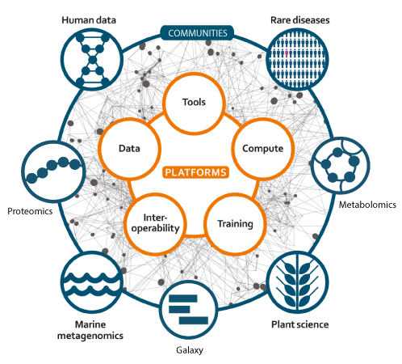
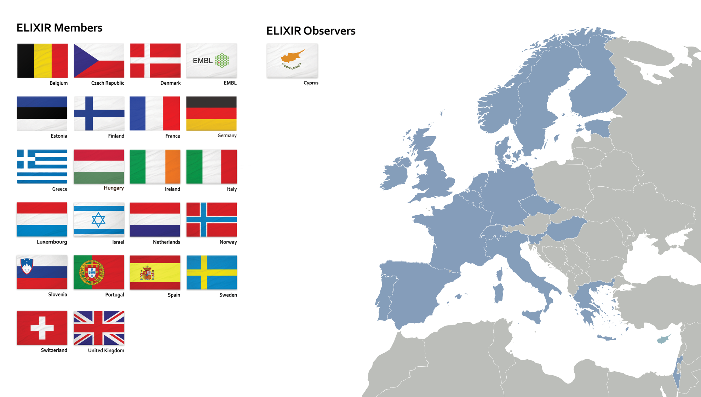
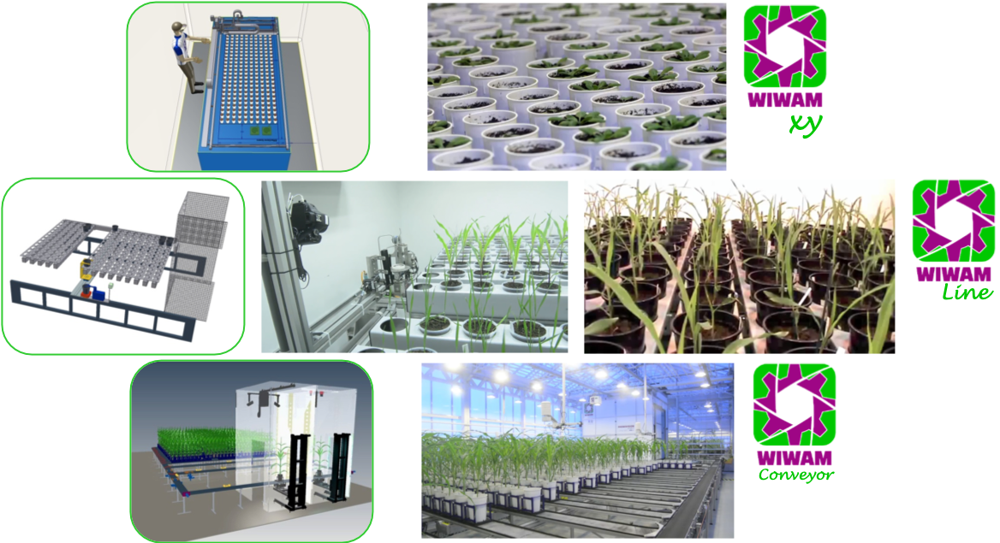
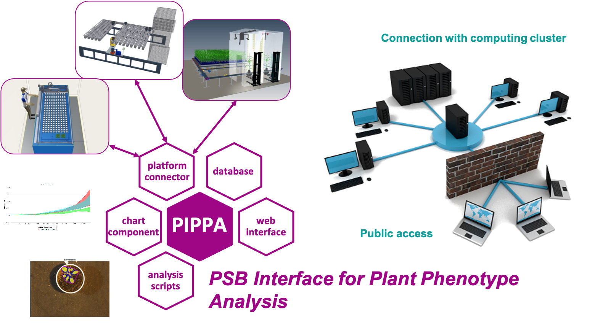
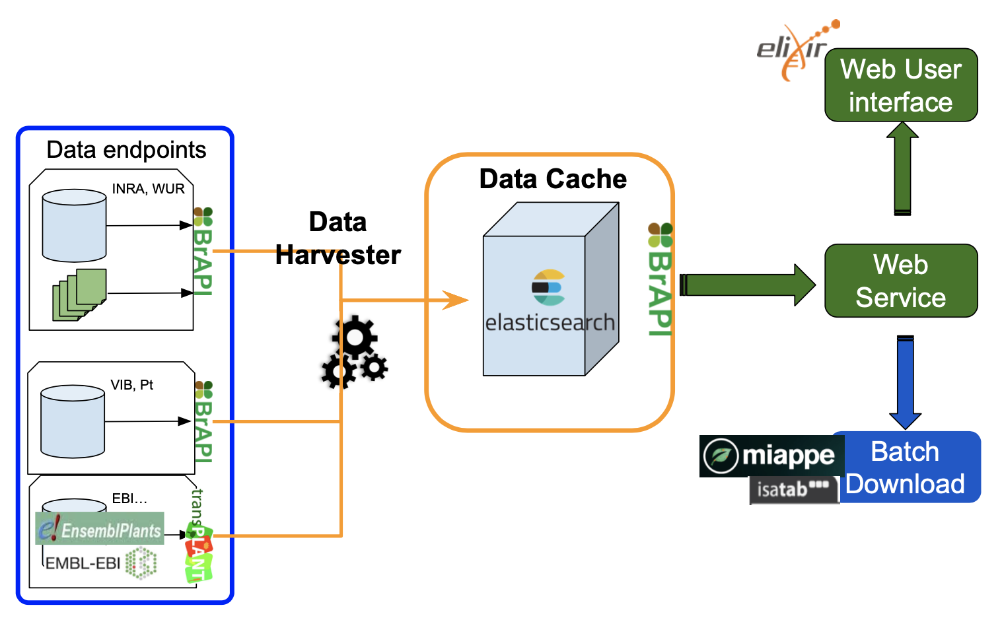
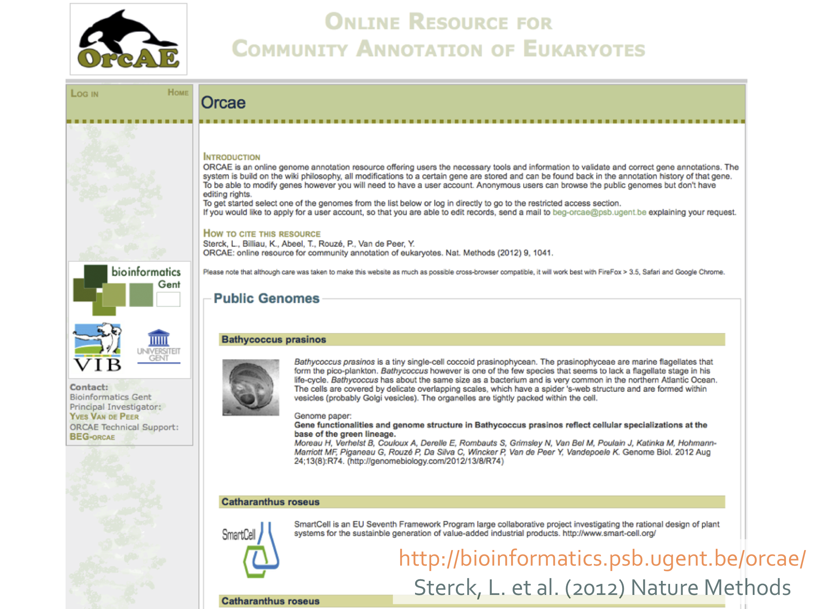
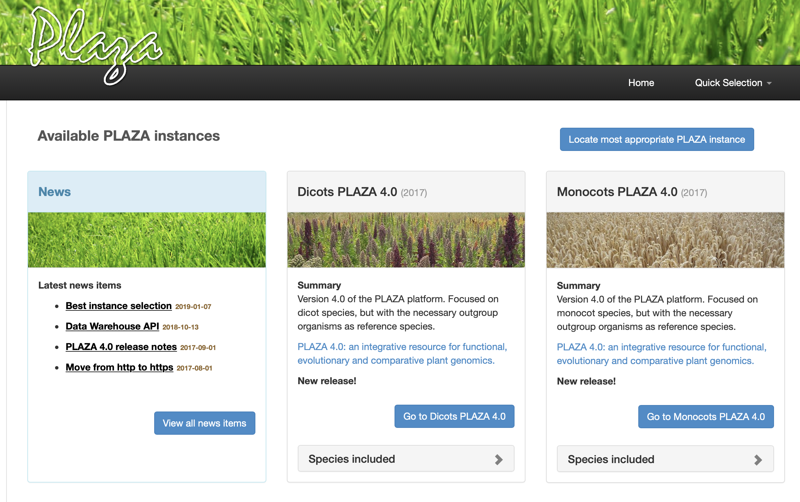
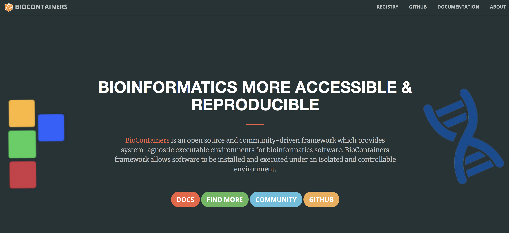
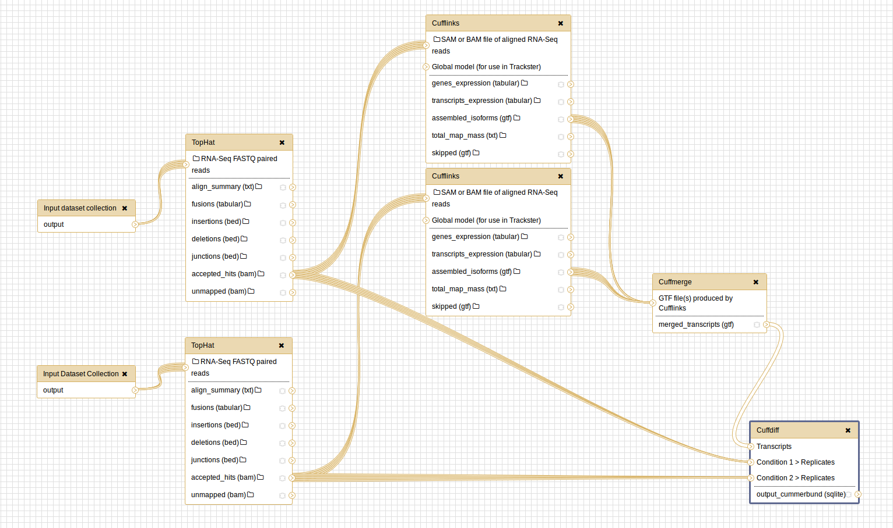
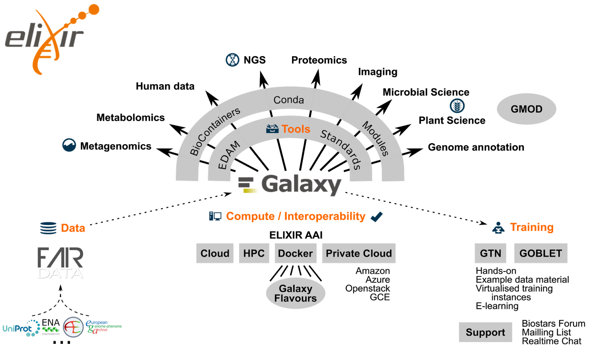

name: title_slide
layout: true
class: right, middle

background-image: url("images/ELIXIR_background.png")
background-position: top
background-repeat: no-repeat
background-size: contain

---
layout: true
name: galaxy_slide

background-color: #2c3143

---

layout: true

---
template: title_slide

## ELIXIR Resources for Interoperability

### Frederik Coppens

#### PAGXXVII Session
#### Interoperability and Federation Across Bioinformatic Platforms and Resources

.italic[www.elixir-europe.org/excelerate]

ELIXIR-EXCELERATE is funded by the European Commission within the Research Infrastructures programme of H2020, grant agreement number 676559. The  sole  responsibility  for  the  content  of  this  presentation  lies  with  ELIXIR.  It  does  not  necessarily  reflect  the  opinion  of  the  European  Union and the European Commission is not responsible for any use than may be made of the information contained therein.

???

https://plan.core-apps.com/pag_2019/abstract/8d1a2a44-8bdc-42f3-90ab-90637edc71cf
https://plan.core-apps.com/pag_2019/event/9441a7255c56cf0ce04b90bfc408a9f3
[https://frederikcoppens.github.io/slidedecks/](https://frederikcoppens.github.io/slidedecks/)

January 12 @ 10h30, 16 minutes

---

# Outline

### ELIXIR

### ELIXIR Services

### ELIXIR Plant Community

### ELIXIR Tools & Workflows

---
template: title_slide

# ELIXIR

# European infrastructure for biological information

---
class: center, middle

# Data infrastructure for Europe’s life-science research

???

ELIXIR is an intergovernmental organisation that brings together life science resources from across Europe. These resources include databases, software tools, training materials, cloud storage and supercomputers.

The goal of ELIXIR is to coordinate these resources so that they form a single infrastructure. This infrastructure makes it easier for scientists to find and share data, exchange expertise, and agree on best practices. Ultimately, it will help them gain new insights into how living organisms work.

---

class: center, middle

# European & beyond

Building collaborations with US, Canada, Australia, ...

---
template: title_slide

# ELIXIR Services

---
class: center, middle

# ELIXIR Services

---

# Deposition Databases for Biomolecular Data

 | 
---- | ----
ArrayExpress | Functional genomics data
BioModels	| Computational models of biological processes
EGA	| Genetic and phenotypic data from biomedical research projects
ENA | Nucleotide sequence information
IntAct	| Molecular interaction data
MetaboLights	| Experimental metabolomics data
PDBe	| Biological macromolecular structures
PRIDE	| Mass spectrometry-based proteomics data

https://www.elixir-europe.org/platforms/data/elixir-deposition-databases

---

# ELIXIR Core Data Resources

#### Fundamental importance to the wider life-science community
#### Long-term preservation of biological information
#### Ensure sustainability

Examples:

  - Deposition Databases
  - Europe PubMed Central
  - Human Protein Atlas
  - Uniprot

https://www.elixir-europe.org/platforms/data/core-data-resources

---

# BioSchemas.org

* .highlight[Schema.org] semantic markup of webpages
* collection of specifications that provide guidelines for markup within life sciences
* Generic service as part of the European Open Science Cloud

.center[]

---

# BioSchemas.org

.center[]

---
template: title_slide

# ELIXIR Plant Community

Leads: Cyril Pommier & Célia Miguel

---

# Phenotyping platforms @ VIB

.center[

[www.wiwam.com](https://www.wiwam.com)
]
---

# Plant Phenotyping Data management

.center[

Similar platforms at INRA (FR), WUR (NL), IPK (GE), NIB (SI)
]

---
class: center, middle

# ELIXIR Plant Community

---
class: center, middle

# ELIXIR Plant Community

### Building on and with international consortia

### BrAPI @ PAG : Genotyping data structures

### Sunday January 13th @ 1PM Crescent room

???

---
template: title_slide

# ELIXIR Belgium

# VIB Plant Resources

---

???

Sterck et al. 2012,  Nature Methods,9:1041

Online annotation (curation) system with database support.
Wiki-style approach: each modification is traceable.
Regulate update and synchronize the data.
Export the annotation into desired format.
Very well suited for browsing and querying data
Blast, keyword searches, AnnoJ genome browser
Both functional as structural info can be edited
Functional (eg. Gene description, go-terms,…) is done via webform
Structural modifications are done via integrated visualisation software (eg. GenomeView)
Currently mainly for genomic data

---
class: center

# PLAZA

[plaza.psb.ugent.be](https://plaza.psb.ugent.be)

???

Cloud version
New version in 2019

---
template: title_slide

# ELIXIR Tools & Workflows

---
class: center,middle

# Tools & Services Registry

.center[]

[bio.tools](https://bio.tools)

???

---
class: center,middle

# Software deployment

.center[]

.center[]

[biocontainers.pro](https://biocontainers.pro/)

---
class: center,middle

# Workflows

---
class: center, middle

# Galaxy

[usegalaxy.org](https://usegalaxy.org)
[usegalaxy.eu](https://usegalaxy.eu)

#### An Open Platform for Data Analysis and Integration

---
class: center, middle

# ELIXIR Galaxy Community

Leads: Björn Grüning, Gildas Le Corguillé, Frederik Coppens

### PAGXXVII Session on Galaxy

### Tuesday January 15th @ 4PM, California

???

* A European network of Galaxy communities
* Visualisation in Galaxy
* Galaxy cloud infrastructure across Europe
* Data access & integration in Galaxy
* Bringing Tools and Data together
* Training
* FAIR and Galaxy

https://plan.core-apps.com/pag_2019/event/9441a7255c56cf0ce04b90bfc40d5302)
https://plan.core-apps.com/pag_2019/abstract/bd1ddd10-af82-4bca-84c0-ff8fe7c5c46a

---
class: center, middle

### 5 ELIXIR Belgium vacancies open next week

[www.vib.be/jobs](http://www.vib.be/jobs)
