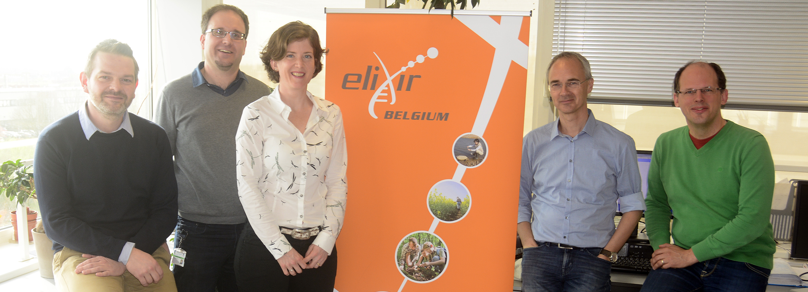

name: title_slide
layout: true
class: right, middle

background-image: url("images/ELIXIR_background.png")
background-position: top
background-repeat: no-repeat
background-size: contain

---

layout: true

---
template: title_slide

# ELIXIR Belgium

## Frederik Coppens

.italic[www.elixir-belgium.org]

---

# Towards a Belgian node

* September 2017 : bilateral agreements in place
* November 2017 : ELIXIR Collaboration Agreement up for approval by Board
* April 2018 : Service Delivery Plan

Structural Flemish funding (2017-18)  

National ESFRI Project call Q1 2018 : funding 2019-2022

---

class: center, middle

# Members of the lead institute

 | 
---- | ----
 Yves Van de Peer | Head of Node
 Frederik Coppens | deputy Head of Node & Technical Coordinator
 Kim De Ruyck | Coordinator ELIXIR Belgium
 Lieven Sterck | Technical Coordinator
 Alexander Botzki | Training Coordinator
 Kristoffer Rapacki | Data Science Cloud Coordinator
 Paula Andrea Martinez | Trainer

---

class: center, middle

# Partners of ELIXIR Belgium

---

# Human Health

###  .highlight[ NGS Logistics]
#### .highlight[ Yves Moreau, KU Leuven ]

Platform for federated analysis of variants

###  .highlight[ VariantDB ]
#### .highlight[  Geert Vandeweyer, Kris Laukens, UAntwerpen ]

Versatile annotation and filtering database: allele frequencies, functional impact, pathogenicity predictions and pathway information

---

# Human Health

###   .highlight[ MS DataConnect ]
#### .highlight[ Liesbet Peeters, Dirk Valkenborg, UHasselt ]
FAIR data for next generation management of multiple sclerosis

---

# Sustainable agriculture

###   .highlight[ PLAZA ]
#### .highlight[ Klaas Vandepoele, VIB/UGent ]
Plant comparative genomics analysis platform

###   .highlight[ ORCAE ]
#### .highlight[  Lieven Sterck, Yves Van de Peer, VIB/UGent ]
Online resource for curation and annotation of eukaryotic genomes

---

# Proteomics

###   .highlight[ Tabloid Proteome ]
#### .highlight[ Lennart Martens, VIB/UGent ]
Database of protein association network generated using publicly available mass spectrometry based experiments in PRIDE

###   .highlight[ Unipept ]
#### .highlight[ Peter Dawyndt, UGent ]
metaproteomics data-analysis tool, focus on interactive data visualisations

---

# Proteomics

###   .highlight[ (IB)² services and databases ]
#### .highlight[ Wim Vranken, VUB ]

* DynaMine: a fast predictor of protein backbone dynamics based sequence information
* DEOGEN2: prediction and interactive visualisation of single amino acid variant deleteriousness in human proteins

---
# Training

Event | In collaboration with | Scheduled
---- | ---- | ----
BYOD BrAPI hackathon | ELIXIR The Netherlands | May 2017
Node services: PLAZA | VIB Bioinformatics Core | September 2017
Bio-molecular data-mining | Kris Laukens (UAntwerpen) | September 2017
Python for Data Processing | Geert-Jan Bex (KUL/UHasselt) | October 2017
Data Carpentry | VIB Bioinformatics Core | November 2017

### Future

* Galaxy
* FAIR data & data management
* Software best practices

---
template: title_slide

# Towards the future

---

# Active in Use Cases

##   Plant Sciences

##  Human Data: Beacons

---

# Activities in new Communities

### Proteomics

* Co-lead Community (Lennart Martens)
* Add Node Services

### Belgian Metabolomics meeting

* September 29, 2017, Ghent
* 18 research groups represented

### ELIXIR Galaxy Community

* Co-lead Community (Frederik Coppens)
* Public webserver
* Training

---

# Activities in Platforms

  |   | 
---- | ---- | ----
 | .highlight[Compute] | Cloud in collaboration with VSC
 | .highlight[Data] | improve link with ELIXIR Core Data Resources
 | .highlight[Interoperability]  | BioSchemas, Open Data & Data Management
  | .highlight[Tools]  | bio.tools, workflows, containers
  | .highlight[Training]  | Continue, expand training portfolio & publish in TeSS

---

# Extending our network

### Prospective new partner
  Scientific Institute for Public Health (WIV-ISP)

### Establishing collaborations

* ESFRIs
* Strategic Research Centers (SOCs)
* SMEs & industry
* Research institutes

e.g. through Interest Group(s)

---

class: center, middle

---

template: title_slide

# ELIXIR HoN Working Group

## Frederik Coppens

---

# WG scope structure and work progress

* F2F meeting (Amsterdam)
* Co-chairs visit Hub
* 3 TCs
* 2 TCs still planned

### The WG scope

1. ELIXIR Platforms
2. Annual Work plan: Commissioned Services
3. Communities

* F2F notes translated into recommendations, prioritised and logically combined
* 2 sub-WGs created to progress further the more complex recommendations

---

# ELIXIR interactions with users

### ELIXIR should consider interacting with users in 4 ways

* Strong national ELIXIR Nodes
* Communities
* Collective participation in international flagship initiatives
* Public interface to ELIXIR Services for individual users

---

# Overview

## .highlight[ELIXIR Communities]
## .highlight[ELIXIR Platforms]
## .highlight[Programme and Annual Work plan: Commissioned Services]

---
template: title_slide

# ELIXIR Communities

---

# Use Cases >>> Communities

* Keep Use Cases naming for ELIXIR-Excelerate
* Next Scientific Programme 2019-2023: switch to .highlight[Communities]

.quote[The term “Use Cases” was coined for the EXCELERATE project and it works well within the
limits of the project. However, “Use Case” has a well-defined meaning in engineering , which
is not suitable for ELIXIR when considering the services we develop and sustain for user
communities in the long-term.]

.quote[Communities will function similarly to Use Cases, where activities will be funded through a variety of sources including Hub-funded Commissioned Services, project-based funding from the European Commission and commitments from ELIXIR Nodes.]

---

# Drivers for Communities

* Bring together a community of experts across the Nodes
* Help trigger these communities to apply for funding
* Drive and prioritise the development of services in Platforms
* Demonstrate broad impact to the users
* Demonstrate that the national services are global leaders

---

# Principles to select and renew ELIXIR Communities

* The HoN committee decides ELIXIR’s Communities
* Same principles for new Communities and renewal

### ELIXIR Communities must

* demonstrate broad impact and benefit to users
* demonstrate contact to an established user community (well-organised in case of renewal)
* demonstrate strong national interest and benefit to participating ELIXIR Nodes
* serve a sizeable scientific community to justify European level investment

---

# Principles to select and renew ELIXIR Communities

* Participating Nodes must demonstrate commitment to the Community in the form of in-kind funding from the Node or by inclusion of the Community in the Node roadmap
* Communities must prepare a roadmap that demonstrates
  * a clear need for bioinformatics infrastructure
  * competent usage of ELIXIR Platforms
  * a value of transnational collaboration (e.g. standards, data exchange)
* It is strongly recommended that the Community considers industry as a user

---
template: title_slide

# ELIXIR Platforms

---

# ELIXIR Platforms
* Leadership
  * Platform roles, responsibilities
  * Place in the governance structure
  * Communication between Platform Leads, HoNs and Hub Platform Coordinators.
* Node participation
  * Organisational (governance) and operational (relationships between Platforms and Nodes) charts, capturing how different groups relate incl. ExCo and Platform Coordinators, TeCG and TrCG.
  * Each Node to declare a person as a point of contact for each Platform who would be involved in RoadMapping and Project planning.

---
template: title_slide

# ELIXIR Programme and Annual Work Plan

---

# ELIXIR Programme and Annual Work Plan

* Enable a bottom up community (users) input by structured representation of national Nodes in
  * Platforms
  * Communities
* Improve communication to Nodes (HoNs) from Platforms and Hub about
  * the tasks at hand
  * input collected
  * due dates
  * priorities defined.
* Priority based approach for Implementation Studies, the Platforms define the priorities followed by approval by HoNs

---

# Work Plan - Peer review Recommendations/ Actions

* Map existing peer review processes & gap analysis
* Define clearly  who is
  * responsible
  * approves
  * supports
* Introduce a post hoc evaluation: impacr
* Assess potential for simplification and process standardisation

---

# Commissioned Services

* Request for proposal, template, criteria for evaluation
* Guiding documents availability
* Resource allocation
* Communications - selection, overview of progress on Studies,  examples of successful plans

---

# Implementation Studies

* Call should be communicated by the Hub with a clear timeframe
* Clear guiding documents, easily findable on intranet.
* Standard template for IS project proposals, including
  * Criteria (also Capacity Building)
  * Rules
* Clear selection criteria, improve communication of the evaluation results to the Nodes.
* Resource allocation
  * Expected number of PM should be part of the tender/call.
  * Hub should indicate resources available, expectations on number of PM per priority under each Platform or Community  
* Introduce feasibility capacity check (indicators).
* Link the Implementation Studies to Node existing services (as per Service Delivery Plan), which also drives involvement in Platforms.
* Make available an overview of all project proposals and Implementation Studies selected.
* Make available examples of successful plans, guidance for writing proposals.

---

# TeCG role

* Define/revise the TeCG role in the process (if any)
* fit into the ELIXIR hierarchy
* define involvement in the process
