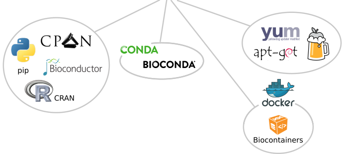

# Sustainable Workflows

### A vision built by community projects

Slides & Figures by Björn Grüning, Bérénice Batut

<!---->
<!--


-->

Note:
https://docs.google.com/presentation/d/1G4f8jWoU0_zSb4rL86_tPRZkMmuTA-SxLmNgIjqUfnU/edit?ts=588e085e#slide=id.p
https://gist.github.com/bgruening/46fe850c3813650a37f3da237d173190


---Slide---

## Workflows

* Helping people with developing workflows
* Supporting people to adopt other workflows
* Capture all necessary details to reproduce a flow of analysis steps
  * Tools and parameters
  * Environment - dependencies of each step
* Ensure relocatable analysis environments

### => Build infrastructure to support this

---Slide---

## Bottom-up : relocatable environments

We need a reliable, cross platform, cross language, Cloud and HPC ready packaging system!



Note:
Left bubble is language specific, yum, apt-get is OS specific,


---Slide---

## Conda & Containers

* Containers have a bright future, but which technology is future-proof ?
* Docker in pole position, but is not HPC friendly yet
* Alternatives: rkt (Rocket), Singularity,… (they already replace Docker in European compute centers)
* Conda
  * more universal
  * has less implications on the compute infrastructure
  * but is less isolated

Note:
Only solutions that are fitting our expectations are Conda and/or Docker
Docker needs to run as root, this is not good. Old HPC do not have a recent Linux Kernel that is need for Docker. And Docker has other    security implications that are not liked by HPC people. For example images can also not be shared between Nodes with Docker.
Conda don’t need root, you can install it everywhere, on 10 year old hardware, no Linux kernel required, it will also run on Windows and so on. But it does not isolate yourself as Docker does, you still have access to the host network, all Filesystems and so on.


---Slide---

## Create once & autogenerate all

* Why choose ? we simple do all at once - automatically
* Conda package definition as central point
* Autogenerate containers out of Conda packages
  * rkt
  * Docker
  * Singularity
  * ...

Note:
Only solutions that are fitting our expectations are Conda and/or Docker

---Slide---

## Create once & autogenerate all


* Only manual step: definition of  Conda package and collection of metadata
* Conda: a very easy yaml syntax to create packages, attach metadata & test

Note:
Autogenerate all containers and potential other package management formats out of the conda package definitions.

---Slide---

## Conda recipes


<!--  -->

```
package:
  name: deeptools
  version: '2.4.2'

source:
  fn: deepTools-2.4.2.tar.gz
  url: https://pypi.python.org/packages/92/54/5de11d1c2c2e0b4dd4afb51f757b95550f0b97fb6566686f27d9e50b0260/deepTools-2.4.2.tar.gz
  md5: 910c61ae21776effd88a067fcdaeee55

build:
  number: 0

requirements:
  build:
    - python
    - setuptools
    - numpy >=1.9.0
    - scipy >=0.17.0
    - matplotlib >=1.4.0
    - pysam >=0.8.2
    - py2bit >=0.2.0
    - gcc
  run:
    - python
    - pybigwig >=0.2.3
    - numpy >=1.9.0
    - scipy >=0.17.0
    - matplotlib >=1.4.0
    - pysam >=0.8.2
    - py2bit >=0.2.0

test:
  imports:
    - deeptools

  commands:
    - bamCompare --version

about:
  home: https://github.com/fidelram/deepTools
  license: GPL3
  summary: A set of user-friendly tools for normalization and visualzation of deep-sequencing data
```

``` sh
#!/bin/bash

$PYTHON setup.py install
```

Note:
* Simple yaml file for defining dependencies and metadata
* Build.sh script defining the `make` dance


---Slide---

## Conda recipes

* 263 GB
* 2598 overall Images
* 332 Perl Images
* 666 R Images (!BioC)
* 266 BioConductor Images
* 817 Python Images

Note:
Btw. all tarballs are automatically backuped.
we should make sure of an EU mirror

---Slide---

### No matter which technology our users use, they get the same binary!
### Inter-technology reproducibility at the lowest level.  

---Slide---

## Talking about metadata

* Conda already collects a bunch of metadata
* Let the registry collect it from BioConda
* Get attached Docker, rkt, Singularity containers for free


Note:
Let bio.tools crawl the conda packages - bio.tools can assume that containers exist for these packages as well.

Frederik: should the arrow then not be towards bio.tools and add one  towards the containers?
Bjoern: bio.tools should get informations from bioconda. What we see in bioconda is that upstream devs are maintaining their own packages. The best what can happen for us! Bio.tools should just collect this data, like google does. The biocontainers URL or name can be inferred by the bioconda stuff … this way you don’t need to ask the biocontainers.

Salva: Our idea from the benchmarking & technical monitoring WP is to collect data for instance from bioconda, aggregate additional information about the software e.g. is it open-source? Does it have a licence? Is there any documentation? etc; we are defining these metric at WP2. Then we will expose this data to bio.tools

---Slide---

## Creating workflows

* Galaxy, Snakemake and 100 additional ones
* **Important: ** support vision of capturing and freezing environments
* Galaxy and Snakemake do !
* Galaxy has support for Containers and Conda packages
* Offer a graphical way to create workflows: **Accessibility**

---Slide---

## Communities

* BioContainers
* Galaxy project
* Snakemake
* BioConda
* CyVerse

Note:
http://www.cyverse.org/ is also using the autogenerated containers
BioContainers are supported from the EBI and they are using now the Conda based Containers.
SnakeMake is using the Conda packages - and is more used than CWL in Europe.


---Slide---

## Sharing of workflows

* Transparent and reproducible research requires easy sharing of workflows
* Endorse people to share workflows by
  * Lower barrier to publish workflows
  * Make them citable (DOIs etc..)
  * Build a system to acknowledge people who publish workflows
* Strenghten myexperiment.org
* Relation between bio.tools and myexperiment.org
* Galaxy is considering an easy submission of workflows to F1000 (myexperiment.org already supported)
