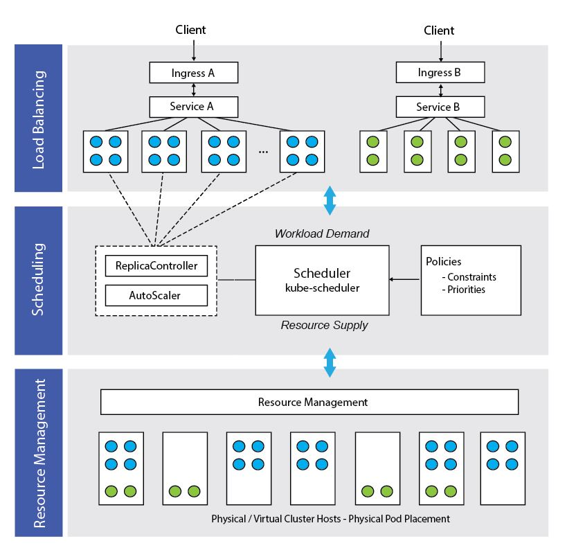

name: title_slide
layout: true
class: right, middle

background-image: url("images/ELIXIR_background.png")
background-position: top
background-repeat: no-repeat
background-size: contain

---
layout: true
name: galaxy_slide

background-color: #2c3143

---

layout: true

---
template: title_slide

## EOSC-life, Tools & Workflows Roadmap

### Frederik Coppens

#### Workshop on Workflow Platforms, April 2-3 2020

---
class: center, middle

---

#### "trusted space for researchers to store their data and access data from other disciplines."

#### "a trusted pool of non-personalised data that governments, businesses and other stakeholders can contribute to...thereby opening up a resource for innovation."

#### "co-create a framework to allow the use of this data."

---
class: center

### Virtual environment

### Seamless integration of services

#### data storage, data management, data analysis, re-use of data

### Across scientific disciplines and borders

---
.center[

]

#### Publishing FAIR life science data resources
#### Establish the policies needed for access

#### Create an ecosystem of innovative life-science tools
#### Connect them to users via a shared single login system

#### Enable ground-breaking data driven research in Europe by connecting life scientists to interoperable European clouds via open calls for participation

---

template: title_slide

# Cloud data analysis

---
class: center, middle

## From data to software and analysis workflows

---

# EOSC-Life Tools & Workflows Roadmap

---

# Embracing cloud

### Cloud == a computer provided by someone else

### Go beyond 'lift & shift', go cloud-native

---

class: center

# Cloud native

## pets versus cattle

---

# Standardized containers

.center[

]

---

## Container-based microservices

.center[

]

---
class: center, middle

