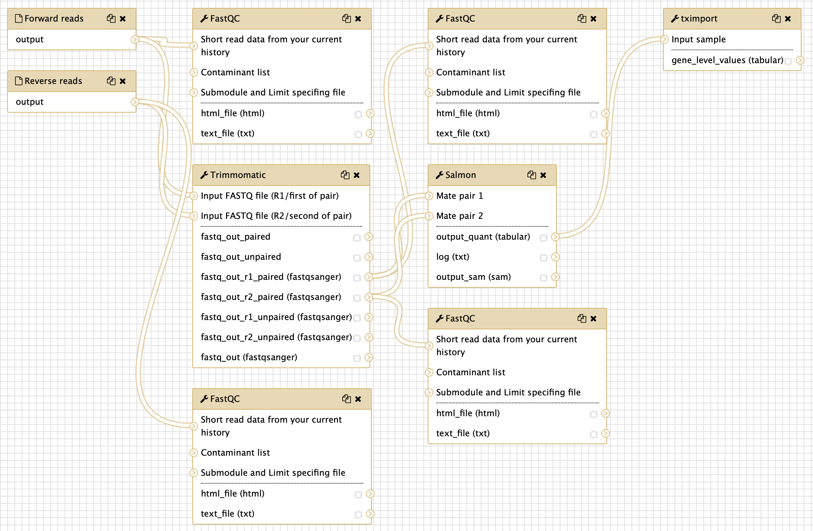
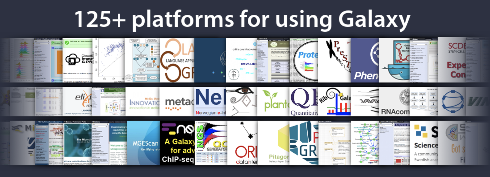
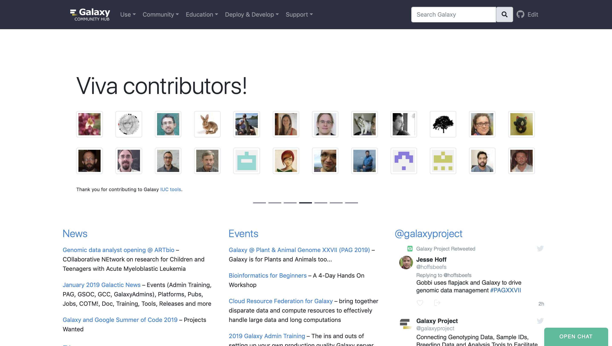
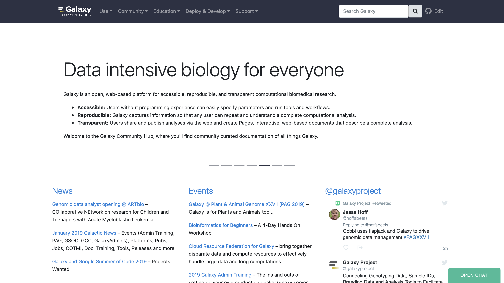
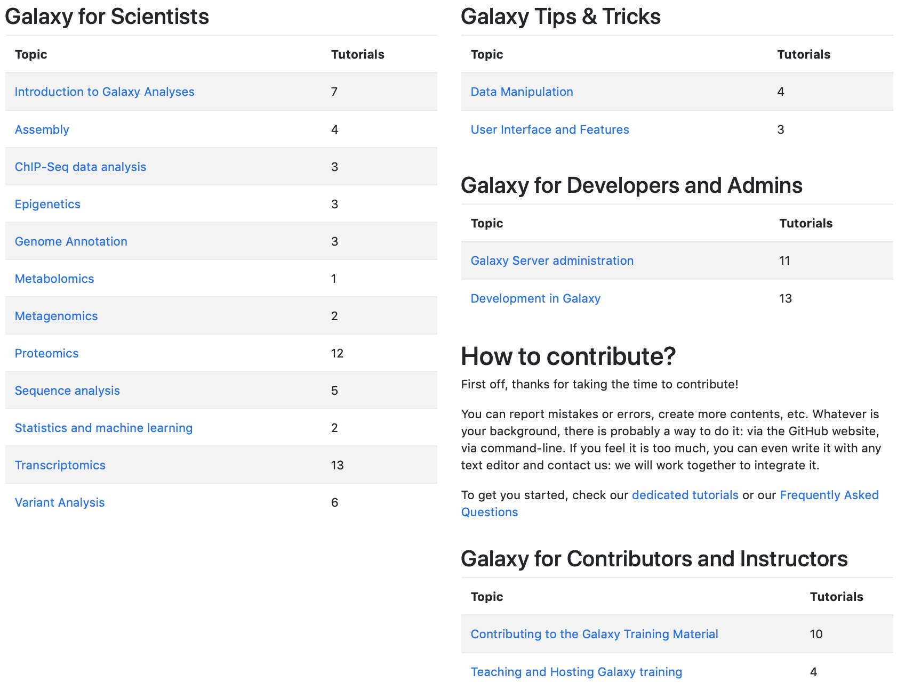
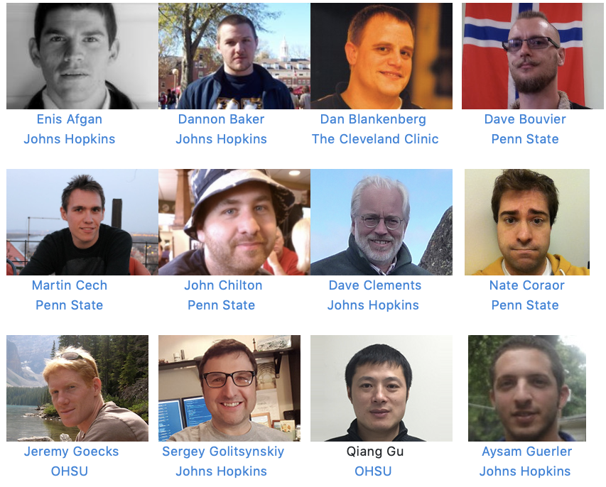
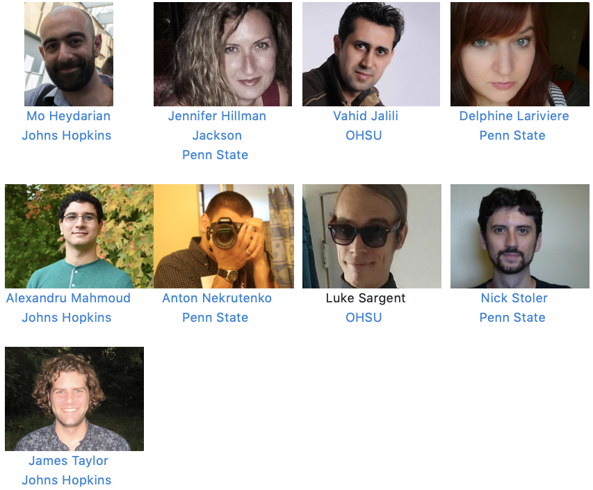

name: title_slide
layout: true
class: right, middle

background-image: url("images/galaxy_project_logo.png")
background-position: top
background-repeat: no-repeat
background-size: 60%

---
layout: true
name: galaxy_slide

background-color: #2c3143

---
layout: true
name: galaxy_title_slide
class: right, middle

background-color: #2c3143

.center[]

---
layout: true

---
template: title_slide

# [Introduction to Galaxy and the Galaxy Ecosystem](https://plan.core-apps.com/pag_2019/abstract/bd1ddd10-af82-4bca-84c0-ff8fe7c5c46a)

### Frederik Coppens

#### PAGXXVII Session: [Galaxy: An Open Platform for Data Analysis and Integration](https://plan.core-apps.com/pag_2019/event/9441a7255c56cf0ce04b90bfc40d5302)

.italic[[www.galaxyproject.org](https://www.galaxyproject.org)]

???

[https://frederikcoppens.github.io/slidedecks/](https://frederikcoppens.github.io/slidedecks/)

January 15 @ 16h, 25 minutes

---
template: galaxy_title_slide

## Galaxy ?

#usegalaxy @galaxyproject

---

template: galaxy_slide
class: center, middle

## Galaxy is an open, web-based platform for accessible, reproducible, and transparent computational biomedical research.

---
template: galaxy_slide
class: center, middle

## Galaxy is an open, web-based platform for accessible, reproducible, and transparent computational biomedical research.

???

---
template: galaxy_slide
class: center, middle

## Galaxy enables non-technical users to leverage bioinformatics tools **themselves** to analyse their data and share results

???

* workflow management system
* web-based user-interface
* inherent support for reproducible science
* facilitates sharing of data and results
* removes the need for users to compile and install tools
* allows non-technical users to leverage compute clusters

---

# Galaxy User Interface

???

usegalaxy.org

---

# Galaxy Workflow builder

---
template: galaxy_title_slide

## How to get Galaxy

---
template: galaxy_slide
class: center, middle

## [ galaxyproject.org/use ](https://galaxyproject.org/use/)

---

# Use Galaxy

* usegalaxy.*
  - usegalaxy.org
  - usegalaxy.au.org
  - usegalaxy.eu
* 108 Public servers
* Commercial clouds
* Academic clouds
* Containers or Virtual Machines

## [ galaxyproject.org/use ](https://galaxyproject.org/use/)

???

GVL
cancer computer
jetstream
NeLS
GenAP
PLGRID

Phenomenal
GalaxyP_logo

---
# Get Galaxy

.center[

#### git clone -b release_18.09 https://github.com/galaxyproject/galaxy.git

### Galaxy is open source can be freely downloaded for a local installation.
]

---
# Galaxy in the cloud

* Genomics Virtual Lab

## [ launch.usegalaxy.org ](https://launch.usegalaxy.org)

## [ galaxyproject.org/cloud ](https://galaxyproject.org/cloud/)

???

http://aws.amazon.com/education
http://globus.org/
http://wiki.galaxyproject.org/Cloud
https://launch.usegalaxy.org/

---
template: galaxy_title_slide

## The Galaxy ecosystem

---
# ELIXIR Galaxy Community

---

# usegalaxy.*

---

# Technologies

* BioConda
* Containers
* CVMFS
* GCVN
* API
  - RESTFUL
  - bioblend (python)
  - bioblend4php
* SDKs: Planemo Ephemeris
* Pulsar

---
template: galaxy_title_slide

## Support

---

# Community

---

# Forum

---

# Gitter Chat

???

on gitter
integrated

---

# Galaxy Community Hub

---

## Mailing lists

## Galactic Search

## News Feed

## Blog

## Galaxy Events

---
class: center

[training.galaxyproject.org](https://training.galaxyproject.org)

---

background-image: url("images/general_flyer.png")
background-position: top
background-repeat: no-repeat
background-size: contain

???

https://github.com/usegalaxy-eu/gcc2019/blob/master/com/general_flyer.png

---
template: galaxy_title_slide

## Acknowledgements

---

# The team

.center[

## [galaxyproject.org/galaxy-team](https://galaxyproject.org/galaxy-team)
]

---

# The community

---
class: center, middle

### 5 ELIXIR Belgium vacancies open next week

[www.vib.be/jobs](http://www.vib.be/jobs)

ELIXIR-EXCELERATE is funded by the European Commission within the Research Infrastructures programme of H2020, grant agreement number 676559. The  sole  responsibility  for  the  content  of  this  presentation  lies  with  ELIXIR.  It  does  not  necessarily  reflect  the  opinion  of  the  European  Union and the European Commission is not responsible for any use than may be made of the information contained therein.

