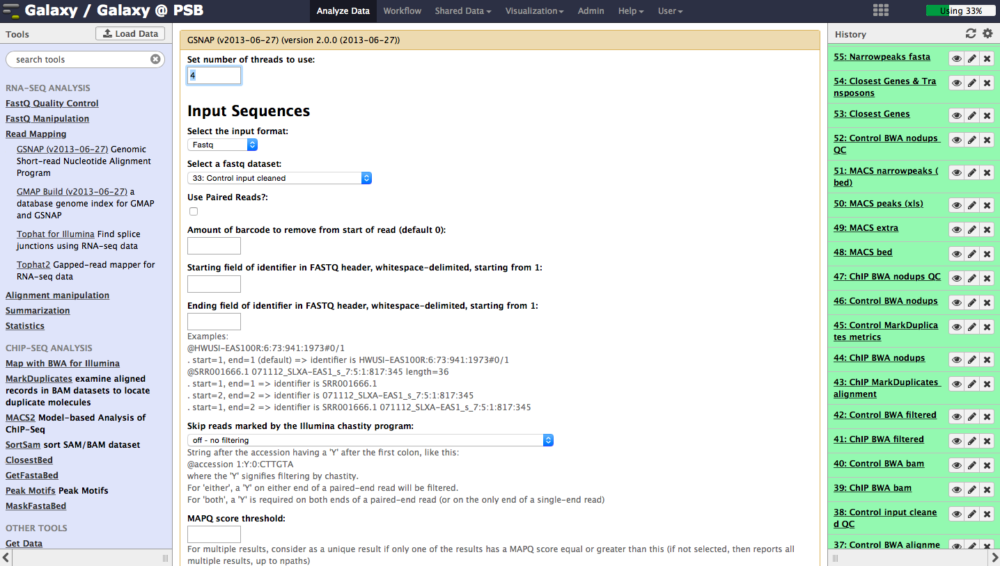
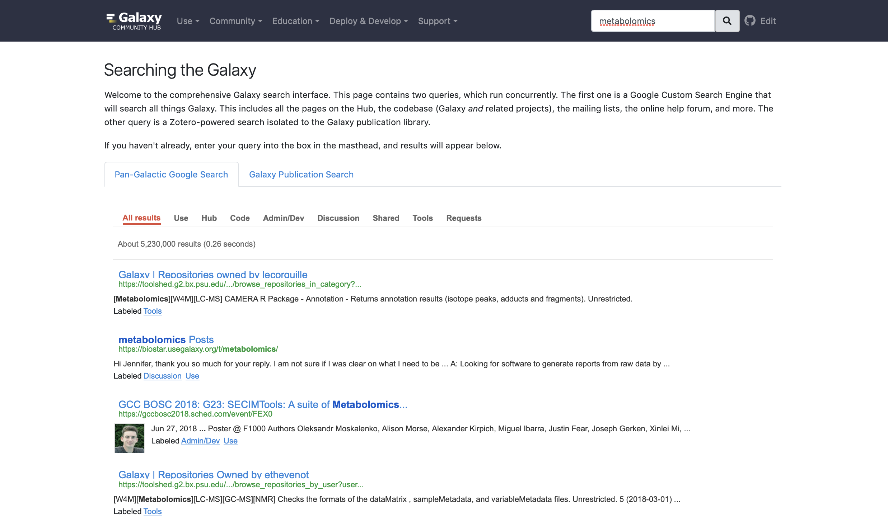
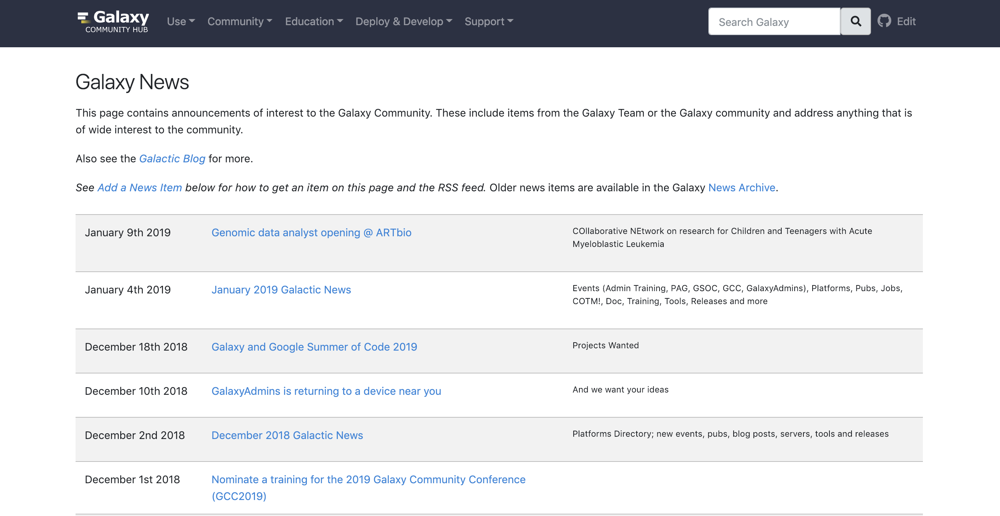

name: title_slide
layout: true
class: right, middle

background-image: url("images/galaxy_project_logo.png")
background-position: top
background-repeat: no-repeat
background-size: 60%

---
layout: true
name: galaxy_slide

background-color: #2c3143

---
layout: true
name: galaxy_title_slide
class: right, middle

background-color: #2c3143

.center[]

---
layout: true

---
template: title_slide

# Galaxy and the Galaxy Ecosystem

### Frederik Coppens

#### VIB Interest Group meeting - January 25th 2019

.italic[[www.galaxyproject.org](https://www.galaxyproject.org)]

---
template: galaxy_title_slide

## Galaxy ?

#usegalaxy @galaxyproject

---
template: galaxy_slide
class: center, middle

.title[
## Galaxy is an .highlight[open], web-based platform for .highlight[accessible], .highlight[reproducible], and .highlight[transparent] computational biomedical research.
]

---
template: galaxy_slide
class: center, middle

.title[
## Galaxy is an .highlight[open], web-based platform for .highlight[accessible], .highlight[reproducible], and .highlight[transparent] computational biomedical research.
]

???

---
template: galaxy_slide
class: center, middle

.title[
## Galaxy enables non-technical users to leverage bioinformatics tools .highlight[themselves] to analyse their data and share results
]
???

* workflow management system
* web-based user-interface
* inherent support for reproducible science
* facilitates sharing of data and results
* removes the need for users to compile and install tools
* allows non-technical users to leverage compute clusters

---

# Galaxy User Interface

---

# Galaxy User Interface 19.01

---
# Galaxy Workflow builder

---
template: galaxy_title_slide

## How to get Galaxy

---
template: galaxy_slide
class: center, middle

## [ galaxyproject.org/use ](https://galaxyproject.org/use/)

---

# Use Galaxy

* usegalaxy.*
  - usegalaxy.org
  - usegalaxy.au.org
  - usegalaxy.eu
* 108 Public servers
* Commercial clouds
* Academic clouds
* Containers or Virtual Machines

.banner[

## [ .highlight[galaxyproject.org/use] ](https://galaxyproject.org/use/)

]

---
# Get Galaxy

.center[

.remark-code[git clone -b release_18.09 https://github.com/galaxyproject/galaxy.git]

.banner[

### Galaxy is .highlight[open source] and can be .highlight[freely downloaded] for a local installation

### [.highlight[galaxyproject.org/admin/get-galaxy]](https://galaxyproject.org/admin/get-galaxy/)
]]

---
class: center

# Galaxy in the cloud

 

.banner[
### [ launch.usegalaxy.org ](https://launch.usegalaxy.org)

### [ galaxyproject.org/cloud ](https://galaxyproject.org/cloud/)
]

???

http://aws.amazon.com/education
http://globus.org/
http://wiki.galaxyproject.org/Cloud
https://launch.usegalaxy.org/

---

## usegalaxy.be

---
template: galaxy_title_slide

## The Galaxy ecosystem

---
# The Galaxy ecosystem

???

---
# The Galaxy ecosystem

---

.center[

.banner[
### 6541 tools wrapped for Galaxy

### [toolshed.g2.bx.psu.edu](https://toolshed.g2.bx.psu.edu)

]

]

---

# Tools & Containers

.right[
Permanent caching 
]
---

# Galaxy subcommunities

---

# Reference data

* genome sequences
* annotations
* indices for common tools
* automation through [ephemeris](https://ephemeris.readthedocs.org/)

### 6TB reference data available on CVMFS

.banner[
### Coming soon : improved plant reference data
]

---

# Accessing compute resources

* Shared storage or streaming
* Configuration
  - Tool
  - User
  - Input data

.banner[
### .highlight[Virtual Galaxy Compute Nodes]

### [github.com/usegalaxy-eu/vgcn](https://github.com/usegalaxy-eu/vgcn)
]

.center[Powered by ]

---
# ELIXIR Galaxy Community

.center[]

.banner[
### Part of the European Open Science Cloud through EOSC-Life project
]

---

# Also for bioinformaticians

* API
  - RESTFUL
  - Python : [bioblend](https://bioblend.readthedocs.io/)
  - PHP : [blend4php](https://github.com/galaxyproject/blend4php)
  - CLI : [parsec](https://github.com/galaxy-iuc/parsec/)
* SDKs
  - 
  - [Ephemeris](https://ephemeris.readthedocs.org/)

---
# The Galaxy ecosystem

---
template: galaxy_title_slide

## Support

---

# Community

---

.center[]

---
# Galaxy Community Hub

---
# Gitter Chat
.center[]
.banner[
### [gitter.im/galaxyproject/Lobby](https://gitter.im/galaxyproject/Lobby)
]
---
.center[]

.banner[
### [help.galaxyproject.org](https://help.galaxyproject.org)
]
---
## Mailing lists

.center[]

.banner[
### [galaxyproject.org/mailing-lists/](https://galaxyproject.org/mailing-lists/)
]

???

  - [galaxy-announce](http://announce.list.galaxyproject.org/)
  - [galaxy-training](http://galaxy-training-mailing-list-archive.35427.n7.nabble.com/)
  - [galaxy-dev](http://dev.list.galaxyproject.org/)
  - ...

---

.center[]

.banner[
### [galaxyproject.org/news/](https://galaxyproject.org/news/)
]
---

.banner[
### [galaxyproject.org/blog/](https://galaxyproject.org/blog/)
]

---
## Galaxy Events

.center[]

.banner[
### [galaxyproject.org/events/](https://galaxyproject.org/events/)
]

---
class: center

.center[]

.banner[
### [training.galaxyproject.org](https://training.galaxyproject.org)
]

???

---
template: galaxy_title_slide

## Acknowledgements

---

# The team

.center[

]
.banner[
## [galaxyproject.org/galaxy-team](https://galaxyproject.org/galaxy-team)
]

---

# The community

---
class: center, middle

### 5 ELIXIR Belgium vacancies open !

[www.vib.be/jobs](http://www.vib.be/jobs) Ghent - Plant Systems Biology

ELIXIR-EXCELERATE is funded by the European Commission within the Research Infrastructures programme of H2020, grant agreement number 676559. The  sole  responsibility  for  the  content  of  this  presentation  lies  with  ELIXIR.  It  does  not  necessarily  reflect  the  opinion  of  the  European  Union and the European Commission is not responsible for any use than may be made of the information contained therein.

---
template: galaxy_slide

background-image: url("images/general_flyer_white.png")
background-position: top
background-repeat: no-repeat
background-size: contain

---
template: galaxy_slide
class: center, middle

