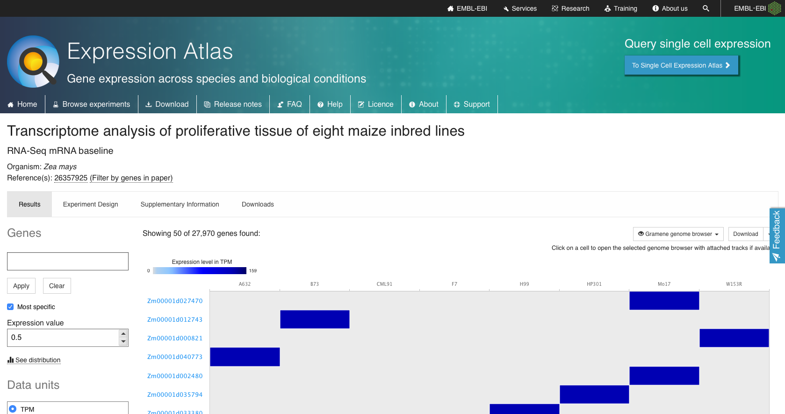

name: title_slide
layout: true
class: left

background-image: url("images/VIB_template.png")
background-position: top
background-repeat: no-repeat
background-size: 100%

---
layout: true
name: vib_final_slide

background-color: #1b2944

background-image: url("images/VIB_final.png")
background-position: middle
background-repeat: no-repeat
background-size: 100%

---
layout: true
name: vib_spacer_slide
class: center, middle

background-image: url("images/VIB_template2.png")
background-position: top
background-repeat: no-repeat
background-size: 100%

---
layout: true

---
template: title_slide

<h1 style="color:white"> The Data Life Cycle </h1>
<h1 style="color:white"> supporting research at PSB </h1>

<h3 style="color:white"> Frederik Coppens </h3>

<h4 style="color:white"> November 6, 2020 </h4>

<a href="https://frederikcoppens.github.io/slidedecks/VIB_ABB_ELIXIR_webinar_20201106/">https://frederikcoppens.github.io/slidedecks/VIB_ABB_ELIXIR_webinar_20201106/</a>

???

Data has become an important aspect in life sciences research. In the last decade new technologies have lead to an exponential increase in the amount of data that is generated in research context. The inherently diverse nature of life science research makes that handling all of this data remains challenging. With the Applied Bioinformatics Group we aim to 1) enable scientists to perform everyday bioinformatic analyses through a user-friendly interface, 2) provide expertise to tackle custom data and statistical analysis. 3) support data management and 4) offer consultancy and training. In this seminar I will showcase some of the projects we have been involved in and solutions we developed over the past years. I will also touch upon ELIXIR, the European Infrastructure on data in Life Sciences, which is coordinated at PSB for Belgium. I will elaborate on how we build on and co-develop the technologies and platforms of ELIXIR to provide support for PSB researchers.

---

template: vib_spacer_slide

<h1 style="color:white">  ABB & ELIXIR </h1>

---

# Applied Bioinformatics and Biostatistics

## enable scientists to perform everyday bioinformatic analyses through a user-friendly interface

## provide expertise to tackle custom data and statistical analysis

## support data management

## offer consultancy and training

---

# Applied Bioinformatics and Biostatistics

## Support for PSB researchers

.center[

]

---

# ELIXIR

## European Research Infrastructure on Data in Life Sciences

## Builds on existing, national resources & people

## Covers all aspects of data

## Driver for the European Open Science Cloud

---

# ELIXIR

.center[

]

---

# Aim of ELIXIR Belgium

### .quote[ to ensure that Belgian researchers in life sciences can focus on their research question, rather than technical details of data, interoperability, compute resources, … by providing tailored solutions based on an interoperable infrastructure across Europe.]

.center[

]

---

# ELIXIR @ PSB

.center[

]

---

template: vib_spacer_slide

<h1 style="color:white">  The data life cycle </h1>

---
class: middle, center

# Data life cycle

???

Plan
Collect
Process
Analyse
Preserve
Share
Re-use

---

template: vib_spacer_slide

<h1 style="color:white">  The planning phase </h1>

---

# Data management planning

---

# DMPs : a possible future

## Ask information to the right persons

* Policies: GDPR, IP, Data retention
* Data backup strategy

## Provide & facilitate best practices

## Towards one list of questions, funder indepedent

---

# Project proposal

## Technical input

* Which sequencing technology is best suited ?
* Cost associated ?
* Data storage estimations

## Experimental setup

* Optimise setup for your research question
* Statistical power analyses

---

# MASC

## Committee to support high-throughput sequencing projects @ PSB

* Experimental setup
  - Timepoint selection
  - Proof-of-concept experiments
* Choice of technology
* Managing costs

## Submit request before starting experimental work !

???

Avoid making the same mistakes again

---

template: vib_spacer_slide

<h1 style="color:white"> Collecting data </h1>

---

# Experimental design

* Optimise sowing/planting/... for statistical analysis
* Design of field trials
* GWAS analysis

## Inquire before starting the experiment !

---

# Phenotyping metadata

---
class: center

# Phenotyping metadata search

https://urgi.versailles.inrae.fr/faidare/

---

# Phenotyping metadata search

---

template: vib_spacer_slide

<h1 style="color:white">  Processing & analysing data </h1>

---
class: center

# Galaxy

https://galaxy.psb.ugent.be

---
class: center

# Galaxy @ VSC

https://usegalaxy.be

---
class: center

# Galaxy @ VSC

## Scalable proteomics MaxQuant analysis

In collaboration with Melanie Föll (University of Freiburg)

---

class: center

# Bioinformatics analyses

## From 'common' analyses

blast, phylogenetic trees, renaming files, ...

## to custom pipelines

## and supporting large projects

---

# Statistical analyses

* RNAseq differential analysis
* qPCR differential analyses
* Root data analyses: counts -> poisson or negative binomial regression
* Germination assays or other assays with a binary outcome: logistic regression
* Longitudinal data analyses: measurement taken over time on the same plants
* Cluster analysis
* ...

---

# Phenotyping analysis

---
class: center

# Data visualisation

http://bioinformatics.psb.ugent.be/webtools/igv_js/psb/psb.php

---
class: center

# PTM viewer

In collaboration with VIB Bioinformatics Core

https://www.psb.ugent.be/webtools/ptm-viewer/

---
class: center

# PLAZA

---

template: vib_spacer_slide

<h1 style="color:white">  Preserve, share & re-use data </h1>

---

# Data submission

## Open Science, Open Data required

* by funders
* by journals

## High on the agenda of policy makers

## Learning curve to do this according to best practices

---
class: center

# Submission to ArrayExpress

---
class: center

# High quality in Expression Atlas

---
class: center

# ELIXIR Deposition Databases

---
class: center

# Submitting viral COVID data

---

class: middle, center

# Data life cycle

---
class: center

# Work in progress: FAIRDOMHub.be

---
template: vib_spacer_slide

<h1 style="color:white"> Training </h1>

---

# Training courses

## Basic statistics course in R
## Differential expression analysis with edgeR
## In preparation: differential expression of qPCR data

### Online courses available on UFORA (UGent)

### Reach out for other topics

---

# Training courses

## Galaxy workflows
## RNAseq processing
## PLAZA introductions
## Working with linux command line

### Reach out for other topics

---
template: vib_spacer_slide

<h1 style="color:white"> How to reach us </h1>

---

# Getting in touch

## Biostatistics

* Book a slot: Intranet - PSB Planner - Support
  - Monday 13:30-18:00
  - Thursday 8:00-12:00
* Statistical consulting form : Intranet - Applications

* Email stathelp@psb.ugent.be

* Open lab on Thursday afternoon (via stathelp)

---

# Getting in touch

## Bioinformatics

* email helpabb@psb.vib-ugent.be (ticket system)

* open lab @ request

---

# Future & ongoing

## Intranet pages
## New trainings
## New analyses
## Data management

---

# Acknowledgements

## ABB team

.center[

]

## ELIXIR team & community

.center[

]

## Galaxy community

---
template: vib_final_slide
