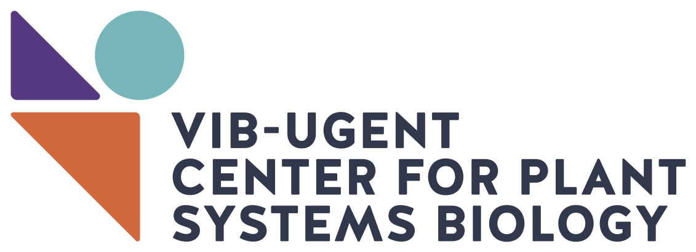
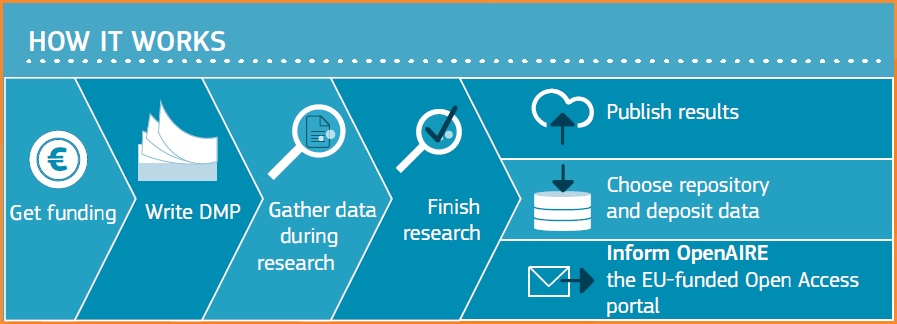
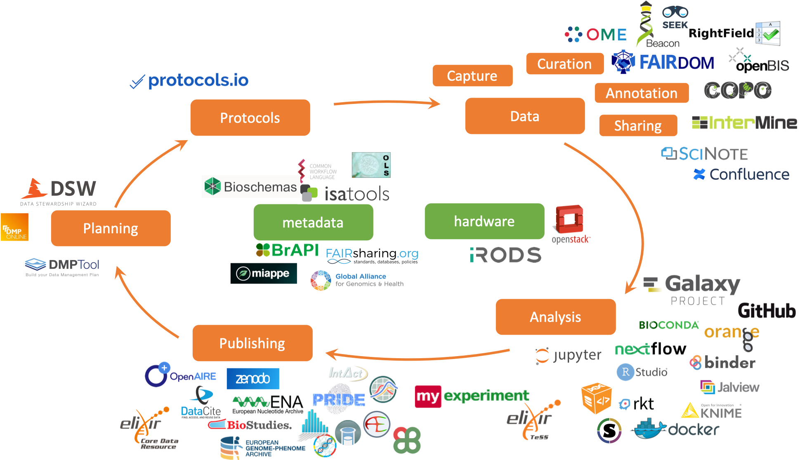
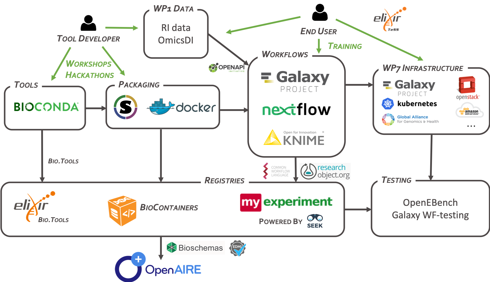

name: title_slide
layout: true
class: left

background-image: url("images/VIB_template.png")
background-position: top
background-repeat: no-repeat
background-size: 100%

---
layout: true
name: vib_final_slide

background-color: #1b2944

background-image: url("images/VIB_final.png")
background-position: middle
background-repeat: no-repeat
background-size: 100%

---
layout: true
name: vib_spacer_slide
class: center, middle

background-image: url("images/VIB_template2.png")
background-position: top
background-repeat: no-repeat
background-size: 100%

---
layout: true

---
template: title_slide

<h1 style="color:white"> Enabling end-users to describe and share software and workflows to allow re-use </h1>

<h3 style="color:white"> Frederik Coppens </h3>

<h4 style="color:white"> Software, algorithms and workflows as part of the scope of the OECD Recommendation </h4>
<h4 style="color:white"> October 15, 2019 Paris </h4>

---

# Background

* BioScience engineer
* PhD on *Arabidopsis thaliana* leaf development at VIB
* During PhD: shift from wetlab to bioinformatics
* Project Leader Applied Bioinformatics and Biostatistics (2013 - )
* IT manager VIB-UGent Center Plant Systems Biology (2015 - )
* Head of Node ELIXIR Belgium (2019), involved since 2014
* ELIXIR Tools & Interoperability Platforms
* Flemish policy office: member WG Open Science
* Member ESFRI SWG DIGIT
* Belgian delegate EOSC WG Architecture

---

# Outline

## The Research Data Life Cycle

## Software development in research

## The push for cloud

## Managed Platforms

---
class: center, middle

# The theory

---

# A lot of questions...

* What should be in a Data Management Plan ?
* Gathering data ? What to gather ?
* Software & scripts are also data ?
* What is metadata ? Never heard of...
* Which repository to choose ? To find & deposit
* How to deposit data & scripts ?

---
class: middle, center

# The practice in life sciences

---

# Complex landscape for researchers

* At all levels of the research cycle many options
* Rapidly changing landscape
* Flexibility is good, guidance is better
* Need for recommendations, best practices

---

# What to use ?

* Already in use by supervisor or colleague
* Commonly used in my domain
* Offered by institute : hosted or subsidised
* I've managed to install that one
* Free online available
* Publications
* Conferences

---
template: vib_spacer_slide

<h1 style="color:white">  Recommendations need to be rooted into implementations </h1>

---

# Software development in research

## Research Grade software

* It works today on my computer
* There might be documentation
* ...

## Professional software development

* Robustness
* Maintainance
* ...

---

# Software development in research

## Often a by-product, few software developers

## Open Source == just giving it all away ?

## Sustainability ? Why ?

---

template: vib_spacer_slide

<h1 style="color:white">  Formulation of recommendations tailored to the audience </h1>

---
class: middle, center

# EOSC-Life Tools Collaboratory

---

template: vib_spacer_slide

<h1 style="color:white">  For end-users workflows should be key </h1>

---

# Cloud is the future ?!

## Cloud is a disruptive concept

* How to communicate to researchers & developers
* How to transition current practices
* How about commercial licenses ?

## Services tailored for the target audience

* IAAS: freedom for developers
* SAAS: managed platforms for researchers

---

# The Galaxy ecosystem

---
template: vib_spacer_slide

<h1 style="color:white">  Platforms as drivers for innovation </h1>

---

# Managed Platforms

* Reduction in flexibility, gains in FAIR
* Underlying technologies & frameworks
* Fit-for-purpose for researchers
* Guidelines to integrate/collaborate for developers

## Long-term sustainability ? What is the cost not to sustain it ?

---
template: vib_spacer_slide

<h1 style="color:white">  Platforms as entry and integration points </h1>

---
template: vib_final_slide
