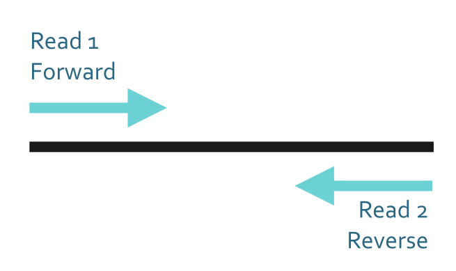
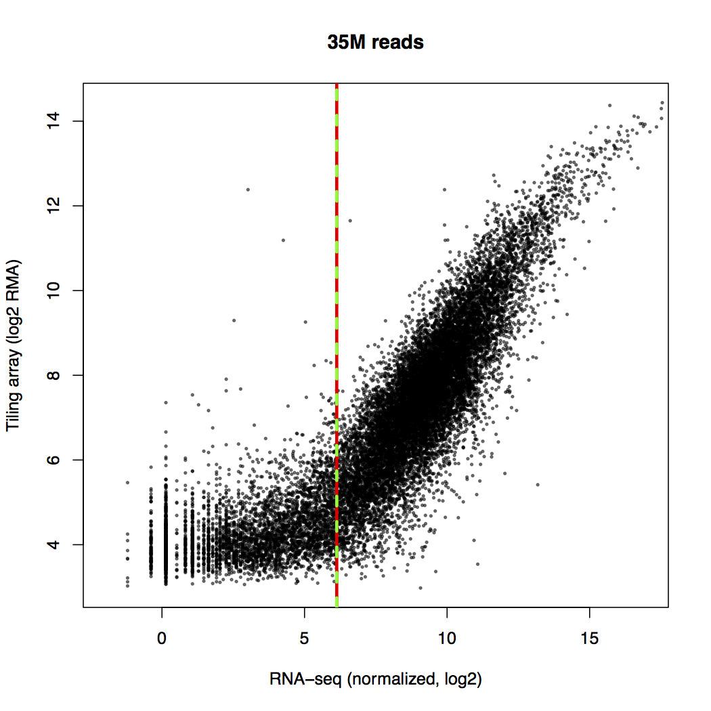
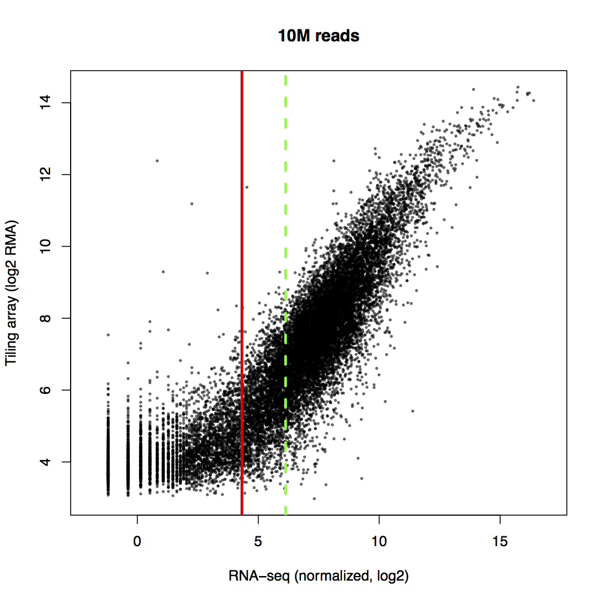
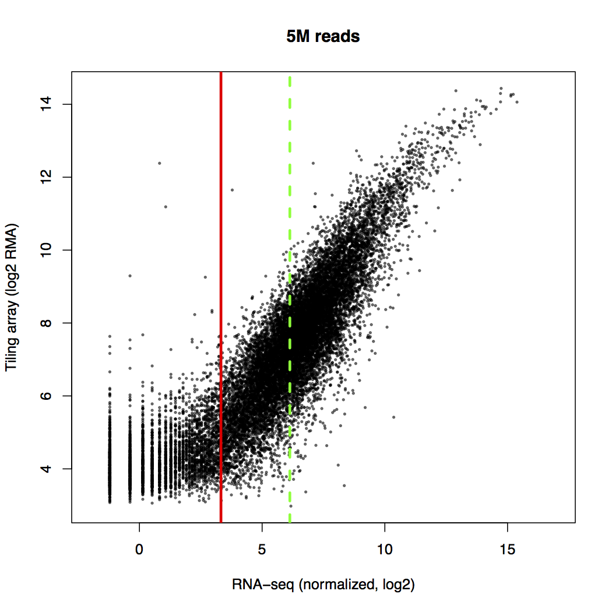
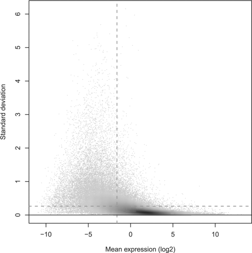
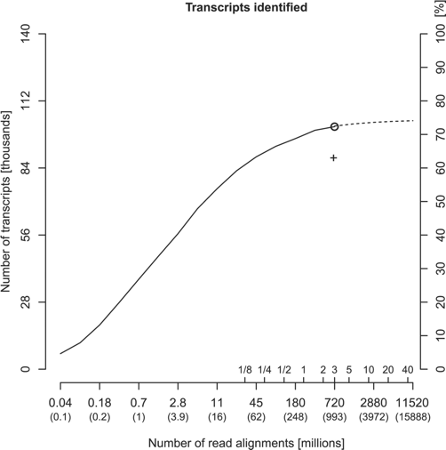
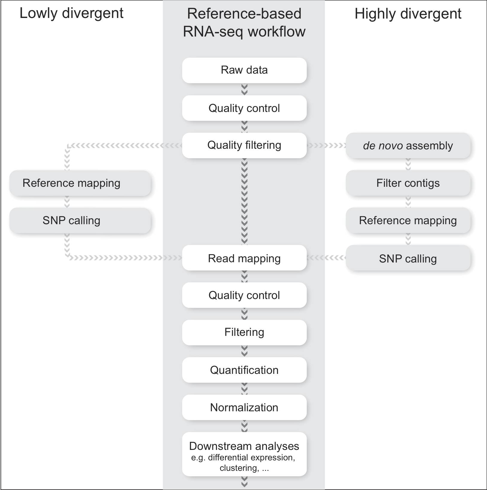

# Platforms

---Slide---

# Platforms

##Short (few hundred bases)

</img>
<!--
</img>
-->

##Long reads (multiple kilobases)
</img>
</img>

---Slide---

# What is your biological question ?

---Section---

# Applications

---Slide---

# Applications

<h2>Quantification</h2>
<ul>
  <li>Gene expression</li>
  <li>Targeted gene expression</li>
  <li>Non-coding RNA</li>
  <li>Small RNA</li>
</ul>
<h2 class="fragment" data-fragment-index="1" style='color:var(--vib-green)'>Known features</h2>

<h2>RNA content</h2>
<ul>
  <li>*de novo* transcriptome assembly</li>
  <li>whole transcripts</li>
  <li>single cell RNA-seq</li>
</ul>
<h2 class="fragment" data-fragment-index="1" style='color:var(--vib-green)'>Discovery</h2>

<!--
Quantification - RNA content - isoform characterization - gene fusion
-->

---Slide---

 Library prep 
 Sequencing 
 Analysis 

---Section---

# Quantification

<ul>
  <li>Gene expression</li>
  <li>Targeted gene expression</li>
  <li>Non-coding RNA</li>
  <li>Small RNA</li>
</ul>

---Slide---

# Quantification

* Select for features in library preparation
* High coverage per feature
* Assign read to a feature

---Slide---

# Quantification

</img>

* Single reads versus Paired-End
* Read length: from 50 to 600 bases
* Stranded
* Sequencing depth

---Slide---

## Library preparation

* RNA extraction
* Selection e.g. poly-A, ribosomal depletion
* Fragmentation e.g. 250 nt
* cDNA synthesis e.g. random primed
* Adapter ligation & PCR amplification

---Slide---

## Single read versus Paired-End

</img>

---Slide---

## Longer & Paired reads increases

* mapping specificity
* unique mapping
* quantification accuracy

 
<ul>
<li>Good quality reference genome: Short Single reads</li>
<li>Low quality or repetitive rich : Long Paired-End reads</li>
</ul>

---Slide---

## Strandedness

* *Original* non-stranded protocol
* Stranded now standard
* Most common protocol d-UTP based: reverse complement
  * Reverse
  * First strand
  * Template
  * Anti-sense

---Slide---

## Sequencing depth

</img>

---Slide---

## Sequencing depth

</img> 

---Slide---

## Sequencing depth

</img>

---Slide---

## Sequencing depth

</img>

---Slide---

## Coverage

For expression quantification 20 million fragments is sufficient : 20K expressed genes at average 1000 counts

</img>
</img>
</img>
</img>

---Slide---

## Low expressed genes ?

</img>

[Bioinformatics. 2011;27(13):i383-i391](https://dx.doi.org/10.1093/bioinformatics/btr247)

---Slide---

## Low expressed genes ?

</img>

[Bioinformatics. 2011;27(13):i383-i391](https://dx.doi.org/10.1093/bioinformatics/btr247)

---Slide---

## Targeted expression profiling

### Hybridization + RNA-seq

<ul>
<li> Select for subset</il>
  <ul>
  <li> Exome sequencing</il>
  <li> Gene panels e.g. disease related</il>
  <li> Genome regions</il>
  </ul>
<li> Library prep contains hybridization step</il>
<li> Decreases read depth needed</il>
<li> Relies on good selection probes !</il>
</ul>

---Section---

# RNA content

<ul>
  <li>*de novo* transcriptome assembly</li>
  <li>whole transcripts</li>
  <li>single cell RNA-seq</li>
</ul>

---Slide---

## Determine transcripts expressed

 re-sequencing 
 *de novo* assembly 
 whole transcripts 

---Slide---

# What is your biological question ?

---Slide---

## Transcriptome re-sequencing

### Determine variants to reference

* Single Nucleotide Polymorphism (SNP)
* Copy Number Variation (CNV)
* Insertion & Deletion (InDel)
* Structural Variant (SV)

---Slide---

## *de novo* transcript assembly

* Assemble short reads to transcripts
* Combine data
  * Paired-End data
  * Mate-pair data
  * Long reads
* Labour intensive
* Results vary with algorithm

---Slide---

## Sequence the whole transcript

* Pacific Biosciences: Iso-seq
* Oxford Nanopore
  * cDNA
  * direct RNA in early access
* Normalization in library preparation ?
* Combining size selections

---Section---

# Analysis

* Quantification
  * Genome/transcriptome mapping
  * Transcriptome inference
* RNA content
  * Assembly
  * Whole transcripts

---Slide---

# Quantification analysis

</img>

---Slide---

# Quantification analysis

* Quality control: discover biases
* Quality filtering: remove very low quality
* Assign to a feature
  * Map to genome & summarize to features
  * Map to transcripts
  * Inference based transcript-level quantification

---Slide---

# Quantification analysis

* Differential expression at gene-level
* Dive into isoform differences
